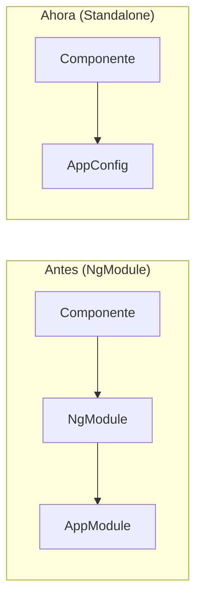
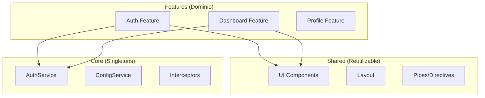
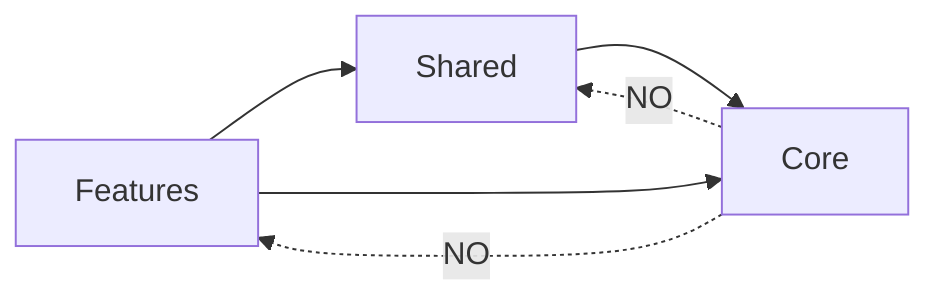

# Día 1: Introducción a Angular 21 y Configuración del Proyecto

## Objetivos de Aprendizaje

Al finalizar este día, serás capaz de:

- [ ] Entender las novedades de Angular 21 y los Standalone Components
- [ ] Configurar un proyecto Angular enterprise desde cero
- [ ] Implementar Path Aliases para evitar el "infierno de imports"
- [ ] Configurar TypeScript strict mode para máxima seguridad
- [ ] Estructurar un proyecto siguiendo buenas prácticas enterprise

---

## 1. Hook (Enganche)

### El Problema del "Infierno de Imports"

Miren este código real de un proyecto desestructurado:

```typescript
// ❌ MAL: Infierno de imports
import { AuthService } from '../../../../../../core/auth/auth.service';
import { UserService } from '../../../../../../core/user/user.service';
import { ConfigService } from '../../../../../../core/config/config.service';
import { HeaderComponent } from '../../../../../../shared/components/header/header.component';
import { SidebarComponent } from '../../../../../../shared/components/sidebar/sidebar.component';
import { User } from '../../../../../../features/auth/models/user.model';
```

**¿Les suena familiar?** 

Este código tiene varios problemas:
1. **Difícil de leer**: ¿Cuántos niveles hay que subir?
2. **Fácil de romper**: Mover un archivo rompe todos los imports
3. **Propenso a errores**: Un punto menos y el código falla
4. **Poco profesional**: No se ve en proyectos enterprise

**Hoy vamos a resolver esto para siempre.**

Al final del día, tus imports se verán así:

```typescript
// ✅ BIEN: Imports limpios con Path Aliases
import { AuthService } from '@core/auth/auth.service';
import { UserService } from '@core/user/user.service';
import { ConfigService } from '@core/config/config.service';
import { HeaderComponent } from '@shared/components/header/header.component';
import { User } from '@features/auth/models/user.model';
```

---

## 2. Contexto

### ¿Por qué es importante esto?

#### Situación Actual del Mercado

El desarrollo de aplicaciones enterprise ha evolucionado significativamente:

| Antes (2018) | Ahora (2026) |
|--------------|--------------|
| NgModules obligatorios | Standalone Components |
| Imports relativos | Path Aliases estándar |
| Configuración básica | TypeScript strict mode |
| Proyectos monolíticos | Arquitectura modular |

#### El Problema en Cifras

Según estudios de la industria:
- **70%** de los proyectos Angular tienen problemas de estructura
- **45%** del tiempo de desarrollo se pierde en refactorizaciones
- **80%** de los bugs se deben a errores de tipado

#### Beneficios de Aprender Esto

1. **Profesionalismo**: Tu código se ve como el de Google, Microsoft, Amazon
2. **Productividad**: Menos tiempo buscando archivos
3. **Mantenibilidad**: Mover archivos no rompe imports
4. **Colaboración**: Equipos enteros usan los mismos alias
5. **Contratación**: Las empresas buscan desarrolladores que sepan esto

#### Conexión con el Proyecto Real

En el proyecto **UyuniAdmin**, que usaremos como referencia:
- [`tsconfig.json`](../../../tsconfig.json) tiene configurados los alias
- Todos los imports usan `@core`, `@shared`, `@features`
- TypeScript está en modo strict
- La estructura sigue DDD Lite

---

## 3. Explicación Simple

### 3.1 Angular 21 y Standalone Components

#### ¿Qué son los Standalone Components?

**Concepto**: Son componentes que no necesitan declararse en un NgModule. Son autónomos y autocontenidos.

**Analogía**: 
> Imagina que antes, para entrar a una fiesta, necesitabas ser miembro de un club (NgModule). Ahora, con Standalone Components, puedes entrar directamente con tu invitación (imports).

#### Comparación Visual



#### Código: Antes vs Ahora

**Antes (Angular 16-)**:
```typescript
// auth.module.ts
@NgModule({
  declarations: [SignInComponent, SignUpComponent],
  imports: [CommonModule, FormsModule],
  exports: [SignInComponent, SignUpComponent]
})
export class AuthModule {}

// app.module.ts
@NgModule({
  imports: [AuthModule]
})
export class AppModule {}
```

**Ahora (Angular 17+)**:
```typescript
// sign-in.component.ts
@Component({
  selector: 'app-sign-in',
  standalone: true,  // ← Esta línea lo hace standalone
  imports: [CommonModule, FormsModule],
  templateUrl: './sign-in.component.html'
})
export class SignInComponent {}

// app.routes.ts
export const routes: Routes = [
  { path: 'signin', loadComponent: () => import('./sign-in.component').then(m => m.SignInComponent) }
];
```

#### Ventajas de Standalone Components

| Ventaja | Descripción |
|---------|-------------|
| **Tree-shaking** | Solo se incluye el código que usas |
| **Lazy loading** | Más fácil de implementar |
| **Menos boilerplate** | No necesitas crear NgModules |
| **Mejor DX** | Menos archivos, más claridad |

---

### 3.2 Path Aliases

#### ¿Qué es un Path Alias?

**Concepto**: Es un nombre corto que representa una ruta larga. Como un "apodo" para una dirección.

**Analogía**:
> Es como guardar un contacto en tu celular. En lugar de memorizar "+1-555-123-4567", guardas "Juan Pérez". Cuando quieres llamar a Juan, solo buscas su nombre.

#### Sin Alias vs Con Alias

```typescript
// ❌ Sin alias: Ruta relativa larga
import { AuthService } from '../../../../../core/auth/auth.service';

// ✅ Con alias: Ruta corta y clara
import { AuthService } from '@core/auth/auth.service';
```

#### Configuración en tsconfig.json

```json
{
  "compilerOptions": {
    "baseUrl": "./",
    "paths": {
      "@core/*": ["src/app/core/*"],
      "@shared/*": ["src/app/shared/*"],
      "@features/*": ["src/app/features/*"],
      "@env/*": ["src/environments/*"]
    }
  }
}
```

#### Desglose de la Configuración

| Campo | Valor | Significado |
|-------|-------|-------------|
| `baseUrl` | `"./"` | Directorio base para resolver rutas |
| `@core/*` | `["src/app/core/*"]` | Alias para la carpeta core |
| `@shared/*` | `["src/app/shared/*"]` | Alias para la carpeta shared |
| `@features/*` | `["src/app/features/*"]` | Alias para la carpeta features |

---

### 3.3 TypeScript Strict Mode

#### ¿Qué es Strict Mode?

**Concepto**: Es una configuración de TypeScript que habilita todas las verificaciones de tipo estrictas.

**Analogía**:
> Es como un inspector de construcción muy exigente. No deja pasar nada que no esté perfectamente construido. Al principio parece molesto, pero al final tienes un edificio sólido.

#### Configuración en tsconfig.json

```json
{
  "compilerOptions": {
    "strict": true,
    "noImplicitOverride": true,
    "noPropertyAccessFromIndexSignature": true,
    "noImplicitReturns": true,
    "noFallthroughCasesInSwitch": true
  }
}
```

#### Beneficios de Strict Mode

| Beneficio | Ejemplo |
|-----------|---------|
| **Detecta null/undefined** | `user.name` → Error si user es null |
| **Evita typos** | `user.nmae` → Error: nmae no existe |
| **Mejor autocompletado** | VS Code sugiere solo propiedades válidas |
| **Refactoring seguro** | Cambiar un nombre actualiza todas las referencias |

#### Ejemplo Práctico

```typescript
// ❌ Sin strict mode: Compila pero falla en runtime
function getUserEmail(user: any) {
  return user.email.toLowerCase(); // Error si email es null
}

// ✅ Con strict mode: Error en compilación
function getUserEmail(user: User | null) {
  return user.email.toLowerCase(); 
  // Error: Object is possibly 'null'
}

// ✅ Solución correcta
function getUserEmail(user: User | null) {
  if (!user) return '';
  return user.email?.toLowerCase() ?? '';
}
```

---

### 3.4 Estructura de Proyecto Enterprise

#### La Regla de las 3 Capas



#### Estructura de Carpetas

```
src/app/
├── core/                    # 🧠 Singletons globales
│   ├── auth/               # Autenticación
│   │   └── auth.service.ts
│   ├── config/             # Configuración
│   │   └── config.service.ts
│   ├── guards/             # Guards de rutas
│   │   └── auth.guard.ts
│   ├── interceptors/       # HTTP interceptors
│   │   └── auth.interceptor.ts
│   └── services/           # Servicios globales
│       ├── loading.service.ts
│       └── logger.service.ts
│
├── shared/                  # 🛠️ Componentes reutilizables
│   ├── components/         # UI components
│   │   ├── header/
│   │   └── sidebar/
│   ├── layout/             # Layout components
│   │   └── app-layout/
│   └── pipes/              # Custom pipes
│
├── features/                # 💼 Módulos de dominio
│   ├── auth/               # Feature: Autenticación
│   │   ├── pages/
│   │   ├── components/
│   │   └── models/
│   ├── dashboard/          # Feature: Dashboard
│   └── profile/            # Feature: Perfil
│
├── app.component.ts        # Componente raíz
├── app.config.ts           # Configuración global
└── app.routes.ts           # Rutas principales
```

#### Reglas de Dependencia



**Reglas**:
- ✅ Features puede importar de Core y Shared
- ✅ Shared puede importar de Core
- ❌ Core NO puede importar de Features o Shared
- ❌ Features NO pueden importar de otros Features directamente

---

## 4. Errores Comunes

### Error 1: "Cannot find module '@core/...'"

**Síntoma**:
```
Error: Cannot find module '@core/auth/auth.service' or its corresponding type declarations.
```

**Causa**: 
- No se configuró el path alias en `tsconfig.json`
- No se reinició el servidor después de modificar `tsconfig.json`

**Solución**:
1. Verificar que `tsconfig.json` tiene la configuración correcta
2. Reiniciar el servidor: `Ctrl+C` y luego `npm start`

**Prevención**:
- Siempre reiniciar después de cambios en `tsconfig.json`
- Usar Ctrl+Click para verificar que el alias funciona

---

### Error 2: "Object is possibly 'null'"

**Síntoma**:
```typescript
const user = this.authService.currentUser();
console.log(user.name); // Error: Object is possibly 'null'
```

**Causa**: 
TypeScript strict mode detecta que `currentUser()` puede retornar `null`.

**Solución**:
```typescript
// Opción 1: Optional chaining
console.log(user?.name);

// Opción 2: Nullish coalescing
console.log(user?.name ?? 'Unknown');

// Opción 3: Type guard
if (user) {
  console.log(user.name);
}
```

---

### Error 3: "Property 'X' does not exist on type 'Y'"

**Síntoma**:
```typescript
interface User {
  name: string;
  email: string;
}

const user: User = { name: 'John', email: 'john@example.com' };
console.log(user.nmae); // Error: Property 'nmae' does not exist
```

**Causa**: 
Typos o propiedades que no existen en el tipo.

**Solución**:
- Verificar el spelling de la propiedad
- Usar autocompletado de VS Code
- Revisar la definición del tipo

---

### Error 4: Imports circulares

**Síntoma**:
```
Warning: Circular dependency detected: AuthService -> ConfigService -> AuthService
```

**Causa**: 
Dos o más archivos se importan mutuamente.

**Solución**:
- Revisar la arquitectura de dependencias
- Extraer interfaces a archivos separados
- Usar inyección de dependencias con `forwardRef()` (último recurso)

---

## 5. Mejores Prácticas

### 5.1 Nomenclatura de Alias

| Alias | Uso | Ejemplo |
|-------|-----|---------|
| `@core/*` | Servicios globales, guards, interceptors | `@core/auth/auth.service` |
| `@shared/*` | Componentes UI, pipes, directives | `@shared/components/button` |
| `@features/*` | Módulos de dominio | `@features/auth/models/user` |
| `@env/*` | Variables de entorno | `@env/environment` |

### 5.2 Cuándo Usar Imports Relativos vs Alias

```typescript
// ✅ Usar relativo: Dentro del mismo módulo
import { User } from './models/user.model';
import { AuthService } from './auth.service';

// ✅ Usar alias: Entre módulos diferentes
import { User } from '@features/auth/models/user.model';
import { AuthService } from '@core/auth/auth.service';
```

### 5.3 Organización de Imports

```typescript
// 1. Imports de Angular
import { Component, inject } from '@angular/core';
import { Router } from '@angular/router';

// 2. Imports de terceros
import { Observable } from 'rxjs';

// 3. Imports de alias (orden alfabético)
import { AuthService } from '@core/auth/auth.service';
import { ConfigService } from '@core/config/config.service';
import { ButtonComponent } from '@shared/components/button/button.component';

// 4. Imports relativos
import { User } from './models/user.model';
```

### 5.4 Configuración de VS Code

Agrega estas configuraciones a `.vscode/settings.json`:

```json
{
  "typescript.preferences.importModuleSpecifier": "non-relative",
  "typescript.preferences.importModuleSpecifierEnding": "minimal",
  "typescript.suggest.paths": true
}
```

---

## 6. Resumen

### Puntos Clave del Día

1. **Angular 21** usa Standalone Components por defecto, eliminando la necesidad de NgModules
2. **Path Aliases** permiten imports limpios como `@core/auth/auth.service`
3. **TypeScript Strict Mode** detecta errores en tiempo de compilación
4. **Estructura Enterprise** separa Core, Shared y Features

### Comandos Clave

```bash
# Crear proyecto
ng new mini-uyuniadmin --standalone

# Instalar dependencias
npm install

# Ejecutar servidor
npm start

# Verificar configuración
npx tsc --noEmit
```

### Archivos Clave

| Archivo | Propósito |
|---------|-----------|
| `tsconfig.json` | Configuración de TypeScript y aliases |
| `angular.json` | Configuración del proyecto Angular |
| `package.json` | Dependencias y scripts |

### Próximos Pasos

En el **Día 2** aprenderemos:
- Arquitectura DDD Lite
- Separación Core/Shared/Features
- Smart vs Dumb Components
- ChangeDetectionStrategy.OnPush

---

## 7. Ejercicios de Refuerzo

### Ejercicio Mental 1
¿Qué salida produce este código con strict mode?

```typescript
const user: { name: string } | null = null;
console.log(user.name);
```

<details>
<summary>Ver respuesta</summary>

Error de compilación: `Object is possibly 'null'`

Solución: `console.log(user?.name);`
</details>

---

### Ejercicio Mental 2
¿Cuál es la diferencia entre estos imports?

```typescript
import { AuthService } from './auth.service';
import { AuthService } from '@core/auth/auth.service';
```

<details>
<summary>Ver respuesta</summary>

- El primero es relativo (dentro del mismo módulo)
- El segundo usa alias (desde otro módulo)
- Ambos son válidos, pero el alias es más robusto para imports entre módulos
</details>

---

### Ejercicio Mental 3
¿Por qué es importante la separación Core/Shared/Features?

<details>
<summary>Ver respuesta</summary>

1. **Core**: Servicios singleton que no dependen de nadie
2. **Shared**: Componentes reutilizables que pueden usar Core
3. **Features**: Módulos de dominio que usan Core y Shared

Esta separación evita dependencias circulares y mantiene el código organizado.
</details>

---

*Curso: Angular 21 Enterprise*
*Versión: 1.0.0*
*Día: 1 de 18*
