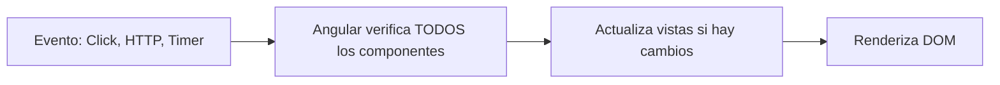
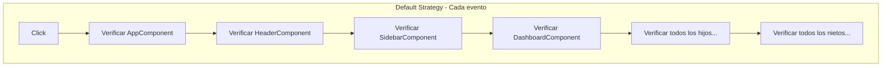
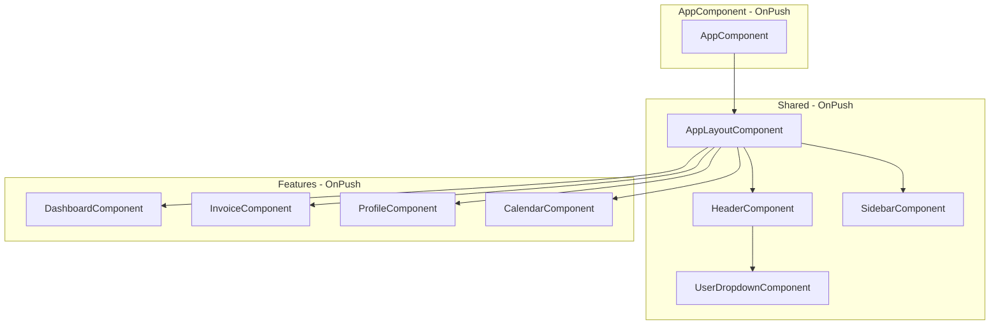
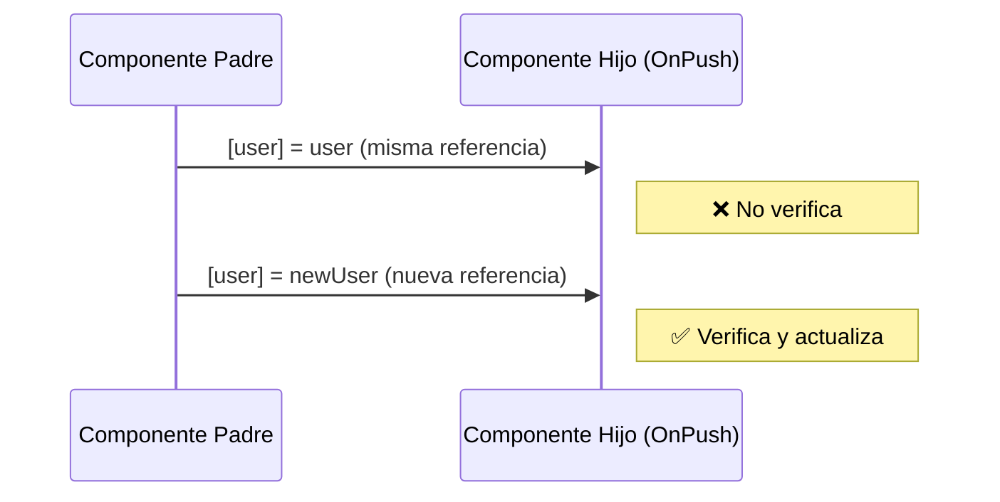
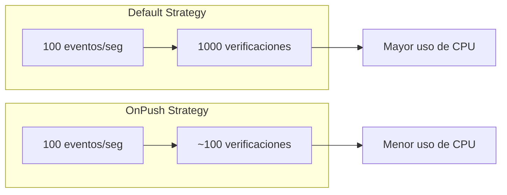
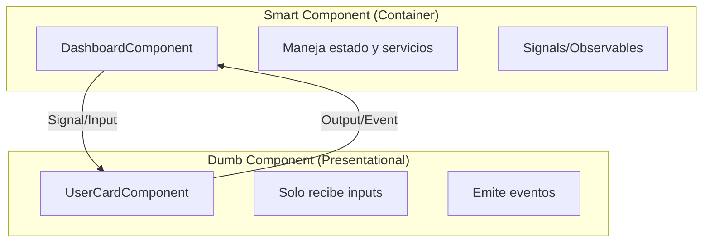
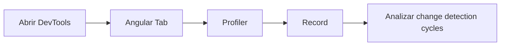

# Guía de ChangeDetectionStrategy.OnPush - UyuniAdmin

## Índice

1. [Introducción](#1-introducción)
2. [¿Qué es Change Detection?](#2-qué-es-change-detection)
3. [Estrategias de Change Detection](#3-estrategias-de-change-detection)
4. [OnPush en UyuniAdmin](#4-onpush-en-uyuniadmin)
5. [Cuándo se Dispara la Detección de Cambios con OnPush](#5-cuándo-se-dispara-la-detección-de-cambios-con-onpush)
6. [Ventajas y Desventajas](#6-ventajas-y-desventajas)
7. [Patrones y Buenas Prácticas](#7-patrones-y-buenas-prácticas)
8. [Ejemplos de Código](#8-ejemplos-de-código)
9. [Troubleshooting](#9-troubleshooting)
10. [Referencias](#10-referencias)

---

## 1. Introducción

Este documento explica la implementación de `ChangeDetectionStrategy.OnPush` en el proyecto **UyuniAdmin Frontend**. Está dirigido a nuevos desarrolladores que se incorporan al equipo y necesitan entender cómo funciona la detección de cambios en Angular y por qué hemos adoptado esta estrategia.

### Estado Actual del Proyecto

| Métrica | Valor |
|---------|-------|
| **Componentes totales** | 52 |
| **Componentes con OnPush** | 52 (100%) |
| **Cobertura** | Completa |

---

## 2. ¿Qué es Change Detection?

**Change Detection** es el mecanismo de Angular que sincroniza el estado de la aplicación con la vista (DOM). Cuando los datos cambian en el componente, Angular necesita detectar esos cambios y actualizar la vista.

### El Problema

Angular necesita saber **cuándo** y **qué** actualizar. Sin una estrategia definida, Angular verifica **todos los componentes** en cada evento:



### El Costo de la Verificación



En una aplicación grande, esto puede causar **problemas de rendimiento**.

---

## 3. Estrategias de Change Detection

Angular ofrece dos estrategias principales:

### 3.1 Default (Por defecto)

```typescript
@Component({
  selector: 'app-example',
  // No especificar changeDetection = Default
})
```

**Comportamiento:**
- Verifica el componente en **cada evento** de la aplicación
- Eventos incluyen: clicks, HTTP requests, timers, promises, etc.
- **Seguro pero ineficiente**

### 3.2 OnPush (Recomendada)

```typescript
@Component({
  selector: 'app-example',
  changeDetection: ChangeDetectionStrategy.OnPush,
})
```

**Comportamiento:**
- Solo verifica cuando **detecta cambios reales**
- Mucho más **eficiente**
- Requiere entender cuándo se dispara

---

## 4. OnPush en UyuniAdmin

### 4.1 Implementación

En UyuniAdmin, **todos los componentes** utilizan `OnPush`. El patrón de implementación es:

```typescript
import { Component, ChangeDetectionStrategy } from '@angular/core';

@Component({
  selector: 'app-example',
  standalone: true,
  changeDetection: ChangeDetectionStrategy.OnPush,  // ← Siempre incluir
  imports: [CommonModule],
  templateUrl: './example.component.html',
  styleUrl: './example.component.css'
})
export class ExampleComponent {
  // ...
}
```

### 4.2 Diagrama de Arquitectura con OnPush



### 4.3 Componentes Actualizados

| Categoría | Componentes | Cantidad |
|-----------|-------------|----------|
| **App** | `AppComponent` | 1 |
| **Shared/Layout** | `AppLayoutComponent`, `AppHeaderComponent`, `AppSidebarComponent`, `BackdropComponent` | 4 |
| **Shared/UI** | `UiSkeletonPageComponent`, `ThemeToggleButtonComponent`, `UserDropdownComponent`, `PageBreadcrumbComponent`, `DropdownComponent`, `DropdownItemComponent` | 6 |
| **Features/Auth** | `SignInComponent`, `SignUpComponent`, `SignInFormComponent`, `SignUpFormComponent`, `AuthPageLayoutComponent`, `GridShapeComponent`, `ThemeToggleTwoComponent` | 7 |
| **Features/Dashboard** | `OverviewComponent`, `EcommerceMetricsComponent`, `MonthlySalesChartComponent`, `MonthlyTargetComponent`, `RecentOrdersComponent`, `RecentOrdersTableComponent` | 6 |
| **Features/Calendar** | `CalendarComponent` | 1 |
| **Features/Charts** | `BarChartComponent`, `LineChartComponent`, `BarChartOneComponent`, `LineChartOneComponent` | 4 |
| **Features/Forms** | `FormElementsComponent` | 1 |
| **Features/Tables** | `BasicComponent`, `DataComponent`, `TableOneComponent`, `TableTwoComponent`, `TableThreeComponent` | 5 |
| **Features/Invoice** | `ListComponent`, `DetailComponent`, `InvoiceTableComponent`, `InvoiceDetailsComponent` | 4 |
| **Features/Profile** | `OverviewComponent`, `ProfileCardComponent`, `ProfileNotificationsComponent`, `ProfileActivityComponent` | 4 |
| **Features/System** | `NotFoundComponent`, `BlankComponent`, `PrimeDemoComponent` | 3 |
| **Features/UI** | `AlertsComponent`, `ButtonsComponent`, `BadgesComponent`, `CardsComponent`, `ListComponent`, `SpinnerComponent`, `ToastComponent` | 7 |
| **TOTAL** | | **52** |

---

## 5. Cuándo se Dispara la Detección de Cambios con OnPush

Con `OnPush`, Angular solo verifica el componente en estos casos:

### 5.1 Cambio de Referencia en Input

```typescript
// ❌ NO dispara cambio (misma referencia)
this.user.name = 'Nuevo Nombre';

// ✅ SÍ dispara cambio (nueva referencia)
this.user = { ...this.user, name: 'Nuevo Nombre' };
```



### 5.2 Evento del Componente

```typescript
// Eventos del DOM
<button (click)="onClick()">Click</button>

// Outputs
<app-child (itemClick)="onItemClick($event)"></app-child>
```

### 5.3 Signals (Angular 16+)

```typescript
@Component({
  changeDetection: ChangeDetectionStrategy.OnPush,
})
export class ExampleComponent {
  // Signals automáticamente disparan detección
  count = signal(0);
  user = signal<User | null>(null);
  
  increment(): void {
    this.count.update(v => v + 1); // ✅ Dispara detección
  }
}
```

### 5.4 Async Pipe

```html
<!-- Async pipe maneja la suscripción automáticamente -->
<div *ngIf="user$ | async as user">
  {{ user.name }}
</div>
```

### 5.5 Inyección Manual (último recurso)

```typescript
import { ChangeDetectorRef } from '@angular/core';

export class ExampleComponent {
  private cdr = inject(ChangeDetectorRef);
  
  updateManually(): void {
    this.data = newData;
    this.cdr.markForCheck(); // Fuerza verificación
  }
}
```

---

## 6. Ventajas y Desventajas

### 6.1 Ventajas ✅

| Ventaja | Descripción |
|---------|-------------|
| **Mejor Performance** | Reduce verificaciones innecesarias hasta en un 90% |
| **Predecibilidad** | Flujo de datos más explícito y fácil de debuggear |
| **Escalabilidad** | La app puede crecer sin degradar rendimiento |
| **Mejores Prácticas** | Fuerza patrones de inmutabilidad |
| **Compatible con Signals** | Funciona perfectamente con Angular Signals |

### 6.2 Desventajas ⚠️

| Desventaja | Mitigación |
|------------|------------|
| **Curva de aprendizaje** | Leer esta guía y practicar |
| **Requiere inmutabilidad** | Usar spread operator o immer |
| **Puede confundir al inicio** | Entender los triggers de detección |
| **Debugging diferente** | Usar Angular DevTools |

### 6.3 Comparación de Performance



---

## 7. Patrones y Buenas Prácticas

### 7.1 Inmutabilidad con Objetos

```typescript
// ❌ Malo - Mutación directa
updateUser() {
  this.user.name = 'Nuevo';
}

// ✅ Bueno - Nueva referencia
updateUser() {
  this.user = { ...this.user, name: 'Nuevo' };
}

// ✅ Mejor - Con Signals
user = signal<User>({ id: 1, name: 'Original' });

updateUser() {
  this.user.update(u => ({ ...u, name: 'Nuevo' }));
}
```

### 7.2 Inmutabilidad con Arrays

```typescript
// ❌ Malo - Mutación directa
addItem(item: Item) {
  this.items.push(item);
}

// ✅ Bueno - Nueva referencia
addItem(item: Item) {
  this.items = [...this.items, item];
}

// ✅ Con Signals
items = signal<Item[]>([]);

addItem(item: Item) {
  this.items.update(items => [...items, item]);
}
```

### 7.3 Inputs con OnPush

```typescript
// Componente hijo
export class UserCardComponent {
  // Input con signal (recomendado)
  readonly user = input.required<User>();
  
  // Computed derivado
  fullName = computed(() => 
    `${this.user().firstName} ${this.user().lastName}`
  );
}
```

### 7.4 Patrón Smart/Dumb con OnPush



```typescript
// Smart Component
@Component({
  changeDetection: ChangeDetectionStrategy.OnPush,
})
export class DashboardComponent {
  private userService = inject(UserService);
  
  // Signal que se actualiza desde servicio
  users = this.userService.users;
  
  handleUserUpdate(user: User): void {
    this.userService.updateUser(user);
  }
}

// Dumb Component
@Component({
  changeDetection: ChangeDetectionStrategy.OnPush,
})
export class UserCardComponent {
  readonly user = input.required<User>();
  readonly updateUser = output<User>();
  
  onEdit(): void {
    this.updateUser.emit({ ...this.user(), modified: true });
  }
}
```

---

## 8. Ejemplos de Código

### 8.1 Componente Típico con OnPush

```typescript
import { Component, ChangeDetectionStrategy, signal, computed, inject } from '@angular/core';
import { CommonModule } from '@angular/common';
import { UserService } from '@features/user/services/user.service';
import { User } from '@features/user/models/user.model';

@Component({
  selector: 'app-user-list',
  standalone: true,
  changeDetection: ChangeDetectionStrategy.OnPush,
  imports: [CommonModule],
  templateUrl: './user-list.component.html',
  styleUrl: './user-list.component.css'
})
export class UserListComponent {
  // Inyección de servicios
  private readonly userService = inject(UserService);
  
  // Estado local con Signals
  isLoading = signal(false);
  searchTerm = signal('');
  
  // Datos desde servicio
  users = this.userService.users;
  
  // Computed values
  filteredUsers = computed(() => {
    const term = this.searchTerm().toLowerCase();
    return this.users().filter(u => 
      u.name.toLowerCase().includes(term)
    );
  });
  
  // Métodos
  onSearch(term: string): void {
    this.searchTerm.set(term);
  }
  
  onRefresh(): void {
    this.isLoading.set(true);
    this.userService.refreshUsers().subscribe({
      complete: () => this.isLoading.set(false)
    });
  }
}
```

### 8.2 Template Correspondiente

```html
<!-- user-list.component.html -->
<div class="user-list">
  <!-- Search -->
  <input 
    type="text" 
    [value]="searchTerm()"
    (input)="onSearch($any($event).target.value)"
    placeholder="Buscar usuario..."
  >
  
  <!-- Loading -->
  @if (isLoading()) {
    <app-spinner />
  }
  
  <!-- List -->
  @else {
    <ul>
      @for (user of filteredUsers(); track user.id) {
        <li>
          {{ user.name }}
          <button (click)="onRefresh()">Actualizar</button>
        </li>
      } @empty {
        <li>No hay usuarios</li>
      }
    </ul>
  }
</div>
```

### 8.3 Servicio con Signals

```typescript
import { Injectable, signal, inject } from '@angular/core';
import { HttpClient } from '@angular/common/http';
import { User } from './user.model';

@Injectable({ providedIn: 'root' })
export class UserService {
  private readonly http = inject(HttpClient);
  
  // Estado reactivo
  private usersSignal = signal<User[]>([]);
  readonly users = this.usersSignal.asReadonly();
  
  constructor() {
    this.loadUsers();
  }
  
  private loadUsers(): void {
    this.http.get<User[]>('/api/users').subscribe({
      next: (users) => this.usersSignal.set(users),
      error: (err) => console.error('Error loading users', err)
    });
  }
  
  refreshUsers() {
    return this.http.get<User[]>('/api/users').pipe(
      tap(users => this.usersSignal.set(users))
    );
  }
  
  updateUser(user: User): void {
    // Actualización inmutable
    this.usersSignal.update(users => 
      users.map(u => u.id === user.id ? user : u)
    );
  }
}
```

---

## 9. Troubleshooting

### 9.1 Problema: La vista no se actualiza

**Síntoma:** Los datos cambian pero la vista no refleja el cambio.

**Causas comunes:**
1. Mutación directa de objetos/arrays
2. Cambios fuera de la zona de Angular
3. Inputs con misma referencia

**Soluciones:**

```typescript
// Problema 1: Mutación directa
this.user.name = 'Nuevo'; // ❌

// Solución: Nueva referencia
this.user = { ...this.user, name: 'Nuevo' }; // ✅

// Problema 2: Cambios fuera de Angular
setTimeout(() => {
  this.data = newData;
  // Si no se actualiza, forzar:
  this.cdr.markForCheck();
}, 1000);

// Problema 3: Mismo objeto en Input
// En el padre:
this.selectedUser = this.users[0]; // Misma referencia

// Solución: Crear nueva referencia
this.selectedUser = { ...this.users[0] };
```

### 9.2 Problema: Detección excesiva

**Síntoma:** La aplicación es lenta a pesar de OnPush.

**Causas:**
1. Eventos frecuentes disparando detección
2. Uso de `Default` en componentes hijos
3. `markForCheck()` excesivo

**Debug con Angular DevTools:**



### 9.3 Herramientas de Debug

```typescript
// Detectar ciclos de detección (desarrollo)
import { Component, ChangeDetectorRef } from '@angular/core';

export class DebugComponent {
  private cdr = inject(ChangeDetectorRef);
  
  constructor() {
    // Contar verificaciones
    let count = 0;
    const original = this.cdr.detectChanges.bind(this.cdr);
    this.cdr.detectChanges = () => {
      console.log(`Change detection #${++count}`);
      original();
    };
  }
}
```

---

## 10. Referencias

### Documentación Oficial

- [Angular Change Detection](https://angular.io/guide/change-detection)
- [Angular Signals](https://angular.io/guide/signals)
- [ChangeDetectionStrategy API](https://angular.io/api/core/ChangeDetectionStrategy)

### Artículos Recomendados

- [Angular OnPush Strategy](https://blog.angular-university.io/onpush-change-detection-how-it-works/)
- [Change Detection in Angular](https://indepth.dev/posts/1503/change-detection-in-angular)
- [Signals vs RxJS](https://angular.io/guide/signals#signals-vs-rxjs)

### Videos

- [Angular Change Detection Explained](https://www.youtube.com/watch?v=CU93K5wu4bw)
- [OnPush Strategy Deep Dive](https://www.youtube.com/watch?v=7OQV3g9Y1H4)

---

## Resumen Ejecutivo

| Concepto | Puntos Clave |
|----------|--------------|
| **OnPush** | Solo verifica cuando hay cambios reales |
| **Triggers** | Input reference change, Events, Signals, Async Pipe |
| **Inmutabilidad** | Siempre crear nuevas referencias para objetos/arrays |
| **Signals** | La forma moderna de manejar estado reactivo |
| **Performance** | Hasta 90% menos verificaciones innecesarias |

---

*Documento creado: Marzo 2026*
*Última actualización: Marzo 2026*
*Proyecto: UyuniAdmin Frontend - Angular v21*
