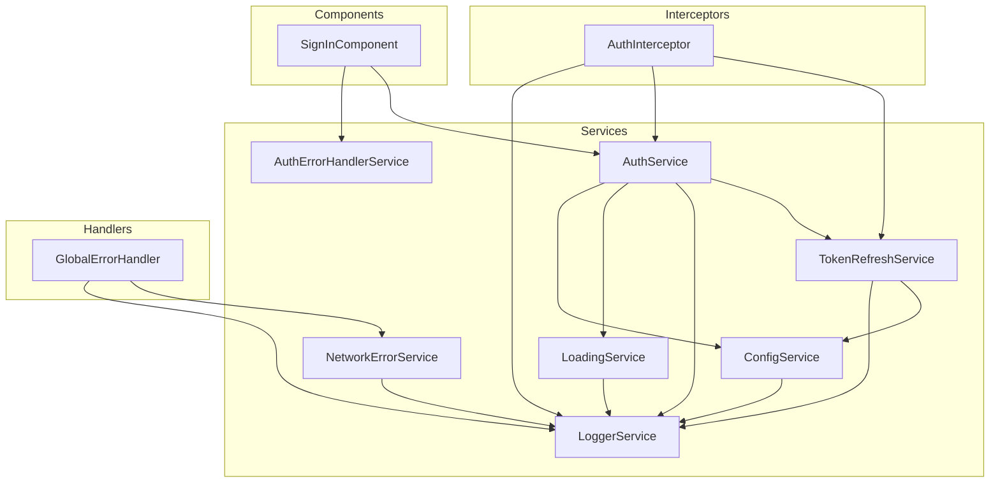

# Mejoras de Clean Code Implementadas

## Resumen

Se han implementado mejoras significativas en el código para cumplir con los principios de Clean Code y SOLID, eliminando problemas identificados en el análisis enterprise.

## Problemas Identificados y Soluciones

### 1. Estado Global en Interceptor ❌ → ✅

**Problema Original:**
```typescript
// auth.interceptor.ts (ANTES)
let isRefreshing = false;  // Variable global mutable
const refreshTokenSubject = new BehaviorSubject<string | null>(null);
```

**Solución Implementada:**
- Creación de [`TokenRefreshService`](src/app/core/services/token-refresh.service.ts) que encapsula toda la lógica de refresh token
- Uso de signals para estado reactivo
- Inyección de dependencias en lugar de variables globales

**Beneficios:**
- ✅ Single Responsibility Principle (SRP)
- ✅ Testabilidad mejorada
- ✅ Estado encapsulado y predecible
- ✅ Thread-safe con RxJS

### 2. Lógica de Negocio en Componentes ❌ → ✅

**Problema Original:**
```typescript
// sign-in.component.ts (ANTES)
if (err.status === 403 && err.error?.detail?.code === 'ACCOUNT_LOCKED') {
  const minutes = Math.ceil(detail.wait_seconds / 60);
  this.errorMessage.set(`Cuenta bloqueada...`);
}
```

**Solución Implementada:**
- Creación de [`AuthErrorHandlerService`](src/app/core/services/auth-error-handler.service.ts)
- Manejo centralizado de errores de autenticación
- Tipado fuerte con `AuthError` y `AuthErrorCode`

**Beneficios:**
- ✅ Separación de responsabilidades
- ✅ Mensajes consistentes
- ✅ Fácil internacionalización
- ✅ Testabilidad

### 3. Console.log en Producción ❌ → ✅

**Problema Original:**
```typescript
// config.service.ts (ANTES)
console.log('Configuration loaded:', config);
```

**Solución Implementada:**
- Creación de [`LoggerService`](src/app/core/services/logger.service.ts)
- Niveles de log configurables (DEBUG, INFO, WARN, ERROR)
- Filtrado automático por configuración

**Beneficios:**
- ✅ Logs controlados por configuración
- ✅ Contexto estructurado
- ✅ Preparado para integración con servicios externos

---

## Nuevos Servicios Creados

### LoggerService

```typescript
// Uso
private logger = inject(LoggerService);

logger.info('User logged in', { userId: user.id }, 'AuthService');
logger.error('API request failed', error, 'HttpInterceptor');
logger.debug('Component initialized', undefined, 'DashboardComponent');
```

**Características:**
- Niveles: DEBUG, INFO, WARN, ERROR, NONE
- Configurable via `config.json`
- Contexto automático
- Preparado para envío a servicios externos

### TokenRefreshService

```typescript
// Uso en interceptor
if (tokenRefreshService.isRefreshing()) {
  return tokenRefreshService.waitForToken().pipe(
    switchMap(token => next(requestWithToken(token)))
  );
}
```

**Características:**
- Estado encapsulado con signals
- Cola de requests durante refresh
- Thread-safe
- Limpieza automática en logout

### AuthErrorHandlerService

```typescript
// Uso en componentes
const authError = this.authErrorHandler.handleLoginError(error);
this.errorMessage.set(authError.message);
```

**Características:**
- Códigos de error tipados
- Mensajes user-friendly
- Detalles estructurados (lockout time, etc.)
- Fácil de extender

---

## Archivos Modificados

| Archivo | Cambio |
|---------|--------|
| [`auth.interceptor.ts`](src/app/core/interceptors/auth.interceptor.ts) | Refactorizado para usar TokenRefreshService |
| [`auth.service.ts`](src/app/core/auth/auth.service.ts) | Integrado LoggerService y TokenRefreshService |
| [`config.service.ts`](src/app/core/config/config.service.ts) | Integrado LoggerService |
| [`loading.service.ts`](src/app/core/services/loading.service.ts) | Integrado LoggerService |
| [`network-error.service.ts`](src/app/core/services/network-error.service.ts) | Integrado LoggerService |
| [`global-error-handler.ts`](src/app/core/handlers/global-error-handler.ts) | Integrado LoggerService |
| [`sign-in.component.ts`](src/app/features/auth/pages/sign-in/sign-in.component.ts) | Usa AuthErrorHandlerService |

---

## Principios SOLID Aplicados

### S - Single Responsibility Principle
- Cada servicio tiene una única responsabilidad
- `TokenRefreshService`: Solo maneja refresh de tokens
- `AuthErrorHandlerService`: Solo maneja errores de auth
- `LoggerService`: Solo maneja logging

### O - Open/Closed Principle
- `LoggerService` extensible para nuevos destinos de log
- `AuthErrorHandlerService` extensible para nuevos códigos de error

### L - Liskov Substitution Principle
- Interfaces bien definidas (`AuthError`, `LogEntry`)

### I - Interface Segregation Principle
- Interfaces específicas y cohesivas
- No se fuerzan métodos innecesarios

### D - Dependency Inversion Principle
- Componentes dependen de abstracciones (servicios)
- Inyección via `inject()`

---

## Diagrama de Dependencias



---

## Próximos Pasos Recomendados

1. **Tests Unitarios**: Crear tests para los nuevos servicios
2. **Internacionalización**: Mover mensajes a archivos i18n
3. **Monitoreo**: Integrar con servicio de logging externo (Sentry, LogRocket)
4. **Documentación API**: Añadir JSDoc completo

---

*Documento generado: 2026-03-13*
*Autor: Kilo Code*
