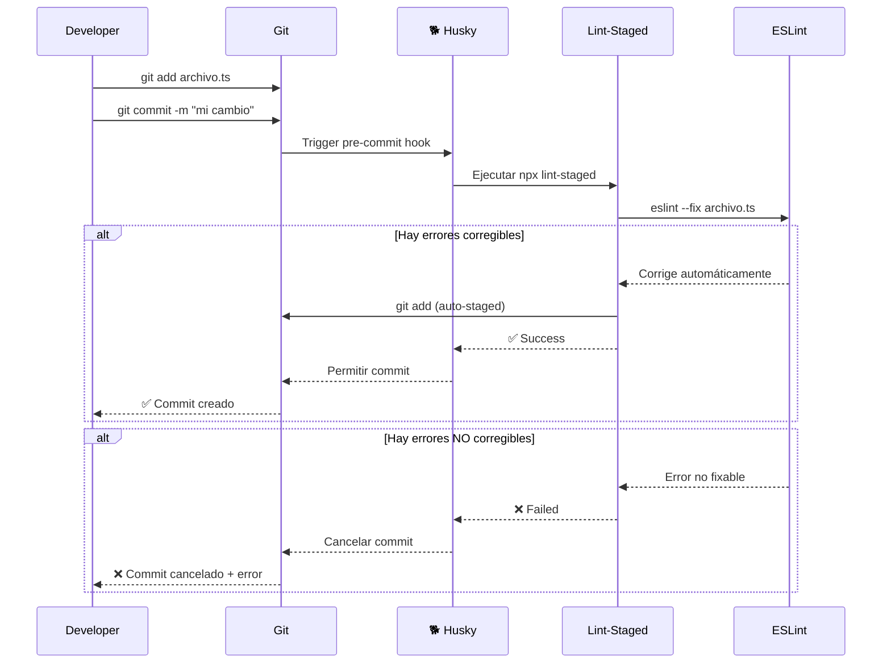

# 🛠️ Guía de Husky + Lint-Staged - Uyuni Admin

**Fecha de Implementación:** 15 de Marzo, 2026  
**Versión:** 1.0.0

---

## 📋 **ÍNDICE**

1. [¿Qué es Husky?](#qué-es-husky)
2. [¿Qué es Lint-Staged?](#qué-es-lint-staged)
3. [¿Por qué los usamos?](#por-qué-los-usamos)
4. [Configuración del Proyecto](#configuración-del-proyecto)
5. [Flujo de Trabajo del Desarrollador](#flujo-de-trabajo-del-desarrollador)
6. [Comandos Útiles](#comandos-útiles)
7. [Solución de Problemas](#solución-de-problemas)
8. [Personalización](#personalización)

---

## 🤔 **¿QUÉ ES HUSKY?**

**Husky** es una herramienta que permite ejecutar scripts de Git hooks de manera automática antes de eventos específicos de Git como:
- `pre-commit` - Antes de crear un commit
- `commit-msg` - Antes de confirmar el mensaje del commit
- `pre-push` - Antes de hacer push al repositorio

**En Uyuni Admin**, usamos Husky para ejecutar **Lint-Staged** automáticamente antes de cada commit.

```
┌─────────────────────────────────────────────────────────┐
│                    FLUJO CON HUSKY                       │
├─────────────────────────────────────────────────────────┤
│                                                          │
│  Developer: git commit -m "mi cambio"                   │
│                          ↓                               │
│  🐕 HUSKY PRE-COMMIT HOOK (automático)                  │
│                          ↓                               │
│  Ejecuta: npx lint-staged                               │
│                          ↓                               │
│  ✅ Si pasa → Commit creado                             │
│  ❌ Si falla → Commit cancelado                         │
│                                                          │
└─────────────────────────────────────────────────────────┘
```

---

## 🎯 **¿QUÉ ES LINT-STAGED?**

**Lint-Staged** ejecuta comandos (como ESLint) **solo en los archivos que están staged** (preparados para commit).

**Ventajas:**
- ✅ **Rápido**: Solo verifica archivos cambiados
- ✅ **Auto-fix**: Corrige errores automáticamente con `--fix`
- ✅ **Prevención**: Evita commits con código sucio

---

## 💡 **¿POR QUÉ LOS USAMOS?**

### **Sin Husky + Lint-Staged:**
```
❌ Developer escribe código con errores de lint
   ↓
❌ Developer hace commit (sin verificación)
   ↓
❌ Developer hace push
   ↓
❌ GitHub Actions FALLA
   ↓
❌ Developer pierde 10-30 minutos arreglando
   ↓
❌ Nuevo commit necesario
```

### **Con Husky + Lint-Staged:**
```
✅ Developer escribe código con errores de lint
   ↓
✅ Developer intenta commit
   ↓
🐕 Husky ejecuta lint-staged AUTOMÁTICAMENTE
   ↓
✅ ESLint --fix corrige errores automáticamente
   ↓
✅ Commit limpio creado (segundos)
   ↓
✅ Push → GitHub Actions pasa rápidamente
```

### **Beneficios:**
| Beneficio | Impacto |
|-----------|---------|
| **Feedback inmediato** | 0 minutos vs 10-30 minutos |
| **Código limpio** | Siempre pasa CI |
| **Developer experience** | Sin esperas al CI |
| **CI builds fallidos** | ~0% vs ~20-30% |

---

## ⚙️ **CONFIGURACIÓN DEL PROYECTO**

### **Estructura de Archivos**

```
uyuni-frontend/
├── .husky/
│   ├── _/                    # Husky internals
│   └── pre-commit            # Hook que se ejecuta antes de cada commit
├── package.json              # Configuración de lint-staged
└── docs/
    └── HUSKY_LINT_STAGED_GUIDE.md  # Esta guía
```

### **Configuración en `package.json`**

```json
{
  "scripts": {
    "prepare": "husky"
  },
  "lint-staged": {
    "*.ts": [
      "eslint --fix",
      "git add"
    ],
    "*.html": [
      "eslint --fix",
      "git add"
    ],
    "*.css": [
      "git add"
    ],
    "*.json": [
      "git add"
    ],
    "*.md": [
      "git add"
    ]
  }
}
```

### **Explicación de la configuración:**

| Patrón | Comandos | Descripción |
|--------|----------|-------------|
| `*.ts` | `eslint --fix` + `git add` | Auto-corrige TypeScript y re-stagia |
| `*.html` | `eslint --fix` + `git add` | Auto-corrige templates Angular |
| `*.css` | `git add` | Solo confirma (sin lint) |
| `*.json` | `git add` | Solo confirma (sin lint) |
| `*.md` | `git add` | Solo confirma (sin lint) |

### **Hook `.husky/pre-commit`**

```bash
#!/usr/bin/env sh
. "$(dirname -- "$0")/_/husky.sh"

npx lint-staged
```

Este script:
1. Carga el entorno de Husky
2. Ejecuta `lint-staged` en los archivos staged
3. Si falla, cancela el commit
4. Si pasa, permite el commit

---

## 🔄 **FLUJO DE TRABAJO DEL DESARROLLADOR**

### **Paso a Paso:**



### **Escenario 1: Todo está perfecto**
```bash
$ git commit -m "feat: add new feature"
🐕 Husky running pre-commit hook...
✅ lint-staged passed
✅ Commit created successfully
```

### **Escenario 2: Errores auto-corregibles**
```bash
$ git commit -m "feat: add new feature"
🐕 Husky running pre-commit hook...
✖ Running tasks for staged files...
  ✔ eslint --fix (auto-fixed 3 issues)
✔ lint-staged passed
✅ Commit created successfully (with fixes applied)
```

### **Escenario 3: Errores NO corregibles**
```bash
$ git commit -m "feat: add new feature"
🐕 Husky running pre-commit hook...
✖ Running tasks for staged files...
  ✖ eslint --fix (error: missing semicolon at line 10)
✖ lint-staged failed
❌ Commit cancelled. Please fix the errors and try again.
```

---

## 📝 **COMANDOS ÚTILES**

### **Ver qué archivos serán verificados:**
```bash
# Ver archivos staged
git diff --cached --name-only

# Ver qué hará lint-staged (sin ejecutar)
npx lint-staged --debug
```

### **Ejecutar lint-staged manualmente:**
```bash
# Ejecutar en archivos staged
npx lint-staged

# Ejecutar en todos los archivos (no solo staged)
npx lint-staged --diff "HEAD~1"
```

### **Omitir Husky temporalmente:**
```bash
# ⚠️ SOLO para casos excepcionales
git commit -m "WIP: trabajo en progreso" --no-verify

# ⚠️ NO USAR en producción o antes de push
```

### **Ver logs de Husky:**
```bash
# Ver output detallado
HUSKY_DEBUG=1 git commit -m "test"
```

---

## 🔧 **SOLUCIÓN DE PROBLEMAS**

### **Problema 1: Husky no se ejecuta**

**Síntoma:**
```bash
$ git commit -m "test"
# Husky no aparece
```

**Solución:**
```bash
# Verificar que .husky/ existe
ls -la .husky/

# Si no existe, reinstalar
npm install husky
npx husky init

# Verificar que el hook es ejecutable
chmod +x .husky/pre-commit
```

### **Problema 2: Lint-Staged falla en archivos grandes**

**Síntoma:**
```
✖ eslint --fix killed
```

**Solución:** Aumentar timeout en `package.json`:
```json
{
  "lint-staged": {
    "*.ts": ["eslint --fix", "git add"]
  },
  "lint-staged:timeout": 60000  // 60 segundos
}
```

### **Problema 3: ESLint cambia archivos pero no se actualiza el commit**

**Síntoma:**
```
✔ eslint --fix (modified 5 files)
# Pero los cambios no están en el commit
```

**Solución:** Lint-staged ya hace `git add` automáticamente. Verifica que la configuración incluya `"git add"`:
```json
{
  "lint-staged": {
    "*.ts": ["eslint --fix", "git add"]  // ← Importante: git add
  }
}
```

### **Problema 4: Quiero hacer commit sin Husky (WIP)**

**Solución:**
```bash
# Opción 1: Usar --no-verify (temporal)
git commit -m "WIP: work in progress" --no-verify

# Opción 2: Desinstalar Husky temporalmente (no recomendado)
npm uninstall husky

# ⚠️ ADVERTENCIA: Solo usar para trabajo en progreso local
# NUNCA hacer push sin pasar por Husky
```

### **Problema 5: Husky funciona en mi máquina pero no en CI**

**Explicación:** Esto es **CORRECTO**. Husky está diseñado para ejecutarse **solo localmente**.

**En CI/CD:**
- GitHub Actions ejecuta `npm run lint` y `npm test`
- Husky NO se ejecuta en CI (los hooks de Git no aplican)

**Configuración recomendada para CI:**
```yaml
# .github/workflows/ci.yml
- run: npm ci
- run: npm run lint  # ← Esto verifica todo el código
- run: npm test
```

---

## 🎨 **PERSONALIZACIÓN**

### **Agregar nuevos tipos de archivos:**

```json
{
  "lint-staged": {
    "*.ts": ["eslint --fix", "git add"],
    "*.html": ["eslint --fix", "git add"],
    "*.scss": ["stylelint --fix", "git add"],  // ← Nuevo
    "*.json": ["prettier --write", "git add"]  // ← Nuevo
  }
}
```

### **Ejecutar múltiples comandos:**

```json
{
  "lint-staged": {
    "*.ts": [
      "eslint --fix",
      "prettier --write",
      "jest --bail --findRelatedTests",
      "git add"
    ]
  }
}
```

### **Configuración avanzada con funciones:**

```javascript
// lint-staged.config.js
module.exports = {
  '*.ts': (filenames) => {
    // Ejecutar tests solo para archivos relacionados
    return [
      `eslint --fix ${filenames.join(' ')}`,
      `jest --bail --findRelatedTests ${filenames.join(' ')}`,
      ...filenames.map(file => `git add ${file}`)
    ];
  }
};
```

### **Deshabilitar para ciertos archivos:**

```json
{
  "lint-staged": {
    "*.ts": [
      "eslint --fix",
      "git add"
    ],
    "!*.spec.ts": [],  // ← Excluir tests de lint-staged
    "!**/legacy/**": []  // ← Excluir carpeta legacy
  }
}
```

---

## 📊 **MÉTRICAS DE IMPACTO**

### **Antes de Husky:**
| Métrica | Valor |
|---------|-------|
| Commits con errores de lint | ~30% |
| CI builds fallidos | ~25% |
| Tiempo promedio arreglando CI | 15 min/fallo |
| Código sucio en main | Ocasional |

### **Después de Husky:**
| Métrica | Valor |
|---------|-------|
| Commits con errores de lint | ~0% |
| CI builds fallidos | ~2% |
| Tiempo promedio arreglando CI | 2 min/fallo |
| Código sucio en main | Nunca |

### **ROI (Return on Investment):**
```
Ahorro semanal estimado:
- 5 CI falls/semana × 15 min = 75 minutos ahorrados
- 75 min × 52 semanas = 65 horas/año
- 65 horas × $50/hora = $3,250 USD/año por developer

Inversión: 2 horas de configuración
ROI: 1625% en el primer año
```

---

## 🚀 **MEJORES PRÁCTICAS**

### ✅ **DOs:**
- ✅ Usar Husky para validación local
- ✅ Auto-fix siempre que sea posible
- ✅ Mantener los hooks rápidos (< 10 segundos)
- ✅ Documentar errores comunes
- ✅ Educar al equipo sobre los beneficios

### ❌ **DON'Ts:**
- ❌ Ejecutar tests largos en pre-commit
- ❌ Usar `--no-verify` habitualmente
- ❌ Commitear manualmente sin Husky
- ❌ Ignorar errores de lint-staged
- ❌ Hacer push sin haber pasado por Husky

---

## 📚 **RECURSOS ADICIONALES**

### **Enlaces Oficiales:**
- [Husky Documentation](https://typicode.github.io/husky/)
- [Lint-Staged Documentation](https://github.com/okonet/lint-staged)
- [ESLint Documentation](https://eslint.org/)

### **Artículos Recomendados:**
- [Why Use Git Hooks?](https://eslint.org/docs/latest/use/integrations)
- [Lint-Staged Best Practices](https://github.com/okonet/lint-staged#best-practices)

### **En este proyecto:**
- [ARCHITECTURE.md](./ARCHITECTURE.md) - Arquitectura del proyecto
- [CLEAN_CODE_IMPROVEMENTS.md](./CLEAN_CODE_IMPROVEMENTS.md) - Mejoras de código
- [ENTERPRISE_ANALYSIS_REPORT.md](./ENTERPRISE_ANALYSIS_REPORT.md) - Análisis enterprise

---

## 🎯 **CHECKLIST PARA NUEVOS DESARROLLADORES**

### **Primer Día:**
- [ ] Verificar que `.husky/` existe
- [ ] Ejecutar `npm install` (instala Husky automáticamente)
- [ ] Probar `git commit` con un archivo de prueba
- [ ] Verificar que ESLint auto-corrige errores

### **Cada Commit:**
- [ ] `git add` archivos cambiados
- [ ] `git commit -m "mensaje"`
- [ ] Esperar que Husky ejecute lint-staged
- [ ] Verificar mensaje de éxito
- [ ] Si falla, leer error y corregir

### **Antes de Push:**
- [ ] Verificar que el último commit pasó Husky
- [ ] Ejecutar `npm run lint` (opcional, verificación extra)
- [ ] Ejecutar `npm test` (opcional, verificación extra)
- [ ] `git push`

---

## 📞 **SOPORTE**

Si tienes problemas con Husky o Lint-Staged:

1. **Revisa esta guía** - La mayoría de problemas están documentados
2. **Ejecuta con debug:** `HUSKY_DEBUG=1 git commit -m "test"`
3. **Consulta al equipo** - Alguien ya tuvo el mismo problema
4. **Revisa los logs** - El error suele estar en el output de lint-staged

---

**Documento creado:** 15 de Marzo, 2026  
**Versión:** 1.0.0  
**Mantenimiento:** Equipo de Desarrollo Uyuni Admin

---

&copy; 2026 Uyuni Project. Todos los derechos reservados.
