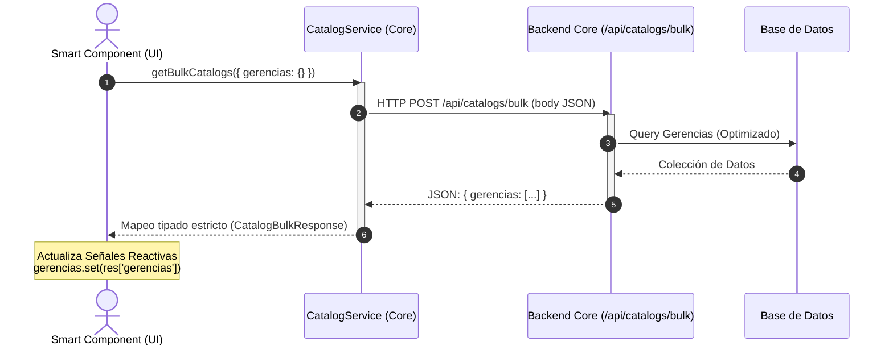

# Guía del Desarrollador: Integración de Catálogos por Lote (Bulk Catalogs)
**Arquitectura de Alto Rendimiento y Densidad de Datos (UyuniAdmin)**

Esta guía didáctica explica detalladamente el patrón de diseño e integración para cargar múltiples selectores (combos desplegables) de catálogos en un único viaje de red (Single Roundtrip) y cómo manejar dependencias jerárquicas utilizando **Angular v21 (Signals)**, **PrimeNG v21** y **Tailwind CSS v4**.

---

## 1. El Problema que Resolvemos y Principio de Arquitectura
En un panel de administración empresarial (ERP), los formularios y barras de filtros suelen requerir poblar 3, 5 o más selectores diferentes (ej: Gerencias, Departamentos, Cargos, Sucursales, Roles, etc.).

### Principio de Responsabilidad Única y Extensibilidad
> [!IMPORTANT]
> **El servicio global `CatalogService` es estrictamente genérico y minimalista.** Expone un único método genérico: `getBulkCatalogs(request)`.
> 
> **Queda estrictamente prohibido añadir métodos helper convenientes (como `getGerencias()`, `getSucursales()`, `getRoles()`) dentro del servicio global.** Si cada módulo agregara sus propios helpers en este servicio principal, este crecería de forma descontrolada con el tiempo. En su lugar, cada **Feature Component** o **Feature Service** es responsable de definir y construir el payload del catálogo exacto que requiere y consumirlo directamente.

---

## 2. Flujo de Datos y Arquitectura (Diagrama)

El siguiente diagrama de secuencia ilustra cómo interactúa el componente de interfaz con el servicio batchable (`CatalogService`) y el endpoint centralizado en el Backend:



---

## 3. Especificación Técnica de Modelos (`catalog.model.ts`)

Todas las peticiones y respuestas de catálogos deben estar tipadas de forma estricta para erradicar el uso del tipo genérico `any` en el código y cumplir con las directivas del Linter del proyecto.

Ubicación: `src/app/core/models/catalog.model.ts`

```typescript
export interface CatalogItem {
  value: string | number;
  label: string;
  extra?: unknown | null;
}

// Para cumplir con @typescript-eslint/consistent-indexed-object-style
// se definen alias de tipo Record en lugar de firmas de índice tradicionales
export type CatalogBulkRequest = Record<string, Record<string, unknown>>;

export type CatalogBulkResponse = Record<string, CatalogItem[]>;
```

---

## 4. El Servicio Global de Catálogos (`catalog.service.ts`)

El servicio centraliza y delega las llamadas. Es 100% genérico y sin dependencias de features individuales.

Ubicación: `src/app/core/services/catalog.service.ts`

```typescript
import { inject, Injectable } from '@angular/core';
import { HttpClient } from '@angular/common/http';
import { Observable } from 'rxjs';
import { ConfigService } from '@core/config/config.service';
import { LoggerService } from '@core/services/logger.service';
import { CatalogBulkRequest, CatalogBulkResponse } from '../models/catalog.model';

@Injectable({
  providedIn: 'root'
})
export class CatalogService {
  private readonly http = inject(HttpClient);
  private readonly configService = inject(ConfigService);
  private readonly logger = inject(LoggerService);

  private readonly baseUrl = `${this.configService.apiUrl}/catalogs/bulk`;

  /**
   * Obtiene múltiples catálogos en una sola llamada batch genérica.
   * @param request Payload con los catálogos solicitados definidos por el Feature
   */
  getBulkCatalogs(request: CatalogBulkRequest): Observable<CatalogBulkResponse> {
    this.logger.debug('Fetching bulk catalogs', { request }, 'CatalogService');
    return this.http.post<CatalogBulkResponse>(this.baseUrl, request);
  }
}
```

---

## 5. Implementación en Componentes Reactivos (Signals)

Para poblar filtros o formularios con dependencias jerárquicas (por ejemplo, cargar **Departamentos** filtrados dinámicamente por el ID de la **Gerencia** elegida), el componente define las consultas inline y las envía directamente al servicio genérico:

Ubicación recomendada: `src/app/features/[modulo]/pages/[modulo]-list.component.ts`

> [!NOTE]
> Para cumplir con la directiva estricta `noPropertyAccessFromIndexSignature` de TypeScript, el acceso a las propiedades dinámicas de `CatalogBulkResponse` debe realizarse utilizando la **notación de corchetes** (ej: `res['gerencias']`) en lugar de punto (ej: `res.gerencias`).

```typescript
import { Component, inject, OnInit, signal, ChangeDetectionStrategy } from '@angular/core';
import { CommonModule } from '@angular/common';
import { FormsModule } from '@angular/forms';
import { Select } from 'primeng/select';
import { Button } from 'primeng/button';
import { CatalogService } from '@core/services/catalog.service';
import { LoggerService } from '@core/services/logger.service';
import { CatalogItem } from '@core/models/catalog.model';

@Component({
  selector: 'app-modulo-list',
  standalone: true,
  imports: [CommonModule, FormsModule, Select, Button],
  templateUrl: './modulo-list.component.html',
  changeDetection: ChangeDetectionStrategy.OnPush
})
export class ModuloListComponent implements OnInit {
  private readonly catalogService = inject(CatalogService);
  private readonly logger = inject(LoggerService);

  // 1. Catálogos cargados
  readonly gerencias = signal<CatalogItem[]>([]);
  readonly departamentos = signal<CatalogItem[]>([]);

  // 2. Valores seleccionados en los filtros
  readonly selectedGerencia = signal<string | null>(null);
  readonly selectedDepartamento = signal<string | null>(null);

  ngOnInit(): void {
    this.loadInitialCatalogs();
  }

  /**
   * Carga inicial batch: traemos las Gerencias usando el método bulk genérico.
   * Usamos acceso de corchetes para cumplir con noPropertyAccessFromIndexSignature.
   */
  private loadInitialCatalogs(): void {
    this.catalogService.getBulkCatalogs({ gerencias: {} }).subscribe({
      next: (res) => {
        this.gerencias.set(res['gerencias'] || []);
      },
      error: (err: Error) => {
        this.logger.error('Error cargando gerencias', err, 'ModuloListComponent');
      }
    });
  }

  /**
   * Evento al cambiar de Gerencia: Carga Departamentos asociados de forma dinámica
   */
  onGerenciaChange(value: string | null): void {
    this.selectedGerencia.set(value);
    
    // Al cambiar la gerencia, se resetea obligatoriamente el departamento hijo
    this.selectedDepartamento.set(null);
    this.departamentos.set([]);

    if (value) {
      // Petición dinámica para traer sub-catálogo filtrado por ID padre
      this.catalogService.getBulkCatalogs({
        departamentos: {
          gerencia_id: value
        }
      }).subscribe({
        next: (res) => {
          this.departamentos.set(res['departamentos'] || []);
        },
        error: (err: Error) => {
          this.logger.error('Error cargando departamentos', err, 'ModuloListComponent');
        }
      });
    }

    this.loadMainTableData(); // Actualiza la grilla de datos principal
  }

  onDepartamentoChange(value: string | null): void {
    this.selectedDepartamento.set(value);
    this.loadMainTableData();
  }

  private loadMainTableData(): void {
    // Lógica para consumir los filtros y recargar datos de la tabla...
  }
}
```

---

## 6. Estándares UI en Plantillas HTML (Tailwind CSS v4 + PrimeNG v21)

Al renderizar los filtros, debemos cumplir con los estándares **Enterprise de Alta Densidad de Datos**, el **Comportamiento Responsivo Híbrido** y usar únicamente el atributo estándar `class` (ya que `styleClass` está deprecado en PrimeNG v21+):

```html
<!-- Fila contenedora en Grid: Apilado vertical en móvil, 4 columnas centradas en escritorio -->
<div class="grid grid-cols-1 sm:grid-cols-2 lg:grid-cols-4 gap-3 mb-4 p-3 bg-gray-50 dark:bg-gray-900 border-round border border-gray-200 dark:border-gray-700 text-sm items-center w-full">
  
  <!-- Filtro Gerencia (Buscador + Overlay appendTo) -->
  <div class="flex flex-col lg:flex-row lg:items-center gap-1 lg:gap-2 w-full min-w-0">
    <span class="font-medium text-700 dark:text-300 white-space-nowrap">Gerencia:</span>
    <p-select 
      [options]="gerencias()" 
      [ngModel]="selectedGerencia()" 
      (ngModelChange)="onGerenciaChange($event)" 
      optionLabel="label" 
      optionValue="value" 
      placeholder="Todas" 
      [showClear]="true" 
      [filter]="true"
      filterPlaceholder="Buscar..."
      filterBy="label"
      appendTo="body"
      class="w-full min-w-0">
    </p-select>
  </div>

  <!-- Filtro Departamento (Deshabilitado reactivo si no hay Padre seleccionado) -->
  <div class="flex flex-col lg:flex-row lg:items-center gap-1 lg:gap-2 w-full min-w-0">
    <span class="font-medium text-700 dark:text-300 white-space-nowrap">Departamento:</span>
    <p-select 
      [options]="departamentos()" 
      [ngModel]="selectedDepartamento()" 
      (ngModelChange)="onDepartamentoChange($event)" 
      optionLabel="label" 
      optionValue="value" 
      placeholder="Todos" 
      [showClear]="true" 
      [disabled]="!selectedGerencia()"
      [filter]="true"
      filterPlaceholder="Buscar..."
      filterBy="label"
      appendTo="body"
      class="w-full min-w-0">
    </p-select>
  </div>
</div>
```

---

## 7. Buenas Prácticas y Reglas Mandatorias (Checklist para el Desarrollador)

1. **Evitar duplicaciones de atributos de estilo:** Nunca declares múltiples veces el atributo `class` ni mezcles `styleClass` en un selector de PrimeNG. Usa únicamente un `class="..."` simplificado.
2. **`appendTo="body"` obligatorio:** Todos los componentes `<p-select>` que se desplieguen dentro de tablas, diálogos o grids deben incluir este atributo. Esto evita recortes por contenedor (`overflow-hidden`) y descentrados en desplazamientos.
3. **`[filter]="true"` para catálogos largos:** Si la colección de un catálogo supera los 10 elementos, proporcione la opción de búsqueda directa ingresando `[filter]="true"` y `filterPlaceholder="Buscar..."`.
4. **Control de textos largos:** Para evitar que un texto largo rompa la cuadrícula o expanda el ancho de la pantalla en dispositivos móviles:
   * Coloque `min-w-0` y `w-full` tanto en el contenedor flex como en la directiva `class` del selector de PrimeNG.
   * Use `white-space-nowrap` en las etiquetas `<span>` para garantizar alineamiento uniforme en una sola línea en pantallas de escritorio.
5. **Reseteo del offset de paginación:** Al gatillar los eventos `onGerenciaChange` u `onDepartamentoChange`, asegúrese de restablecer el offset/página actual a `0` para evitar pantallas en blanco si el usuario ya se encontraba en páginas avanzadas del listado.
