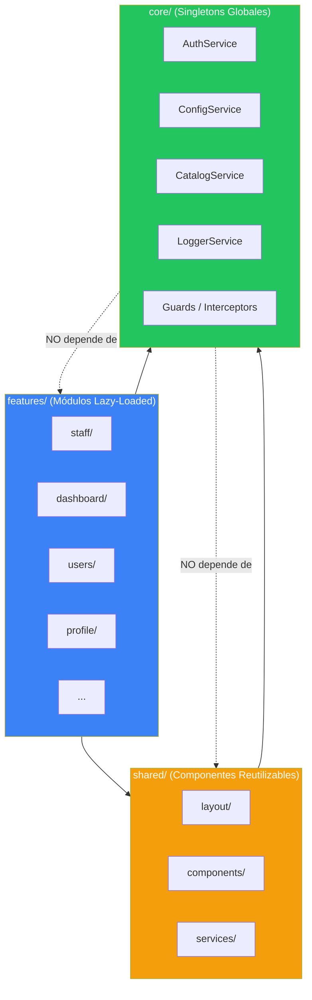
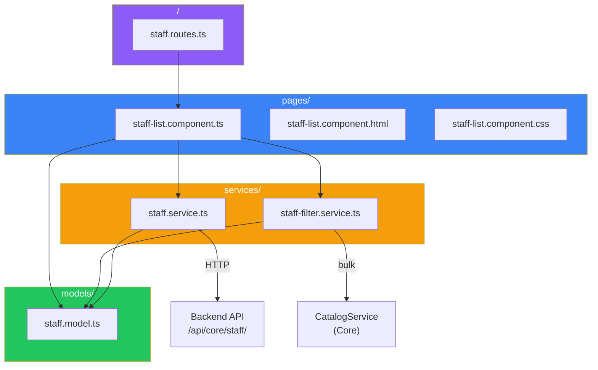
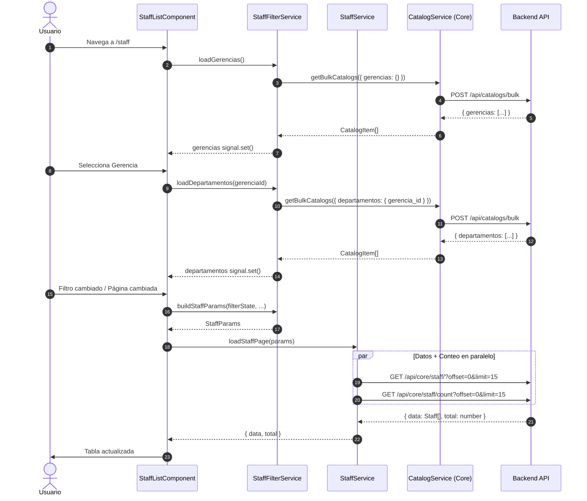
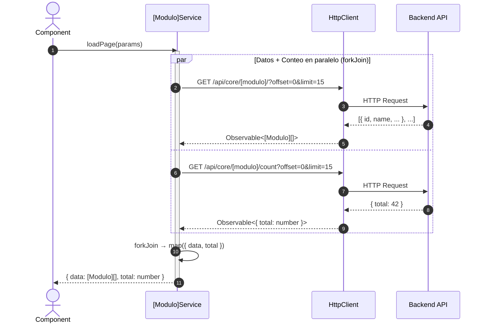
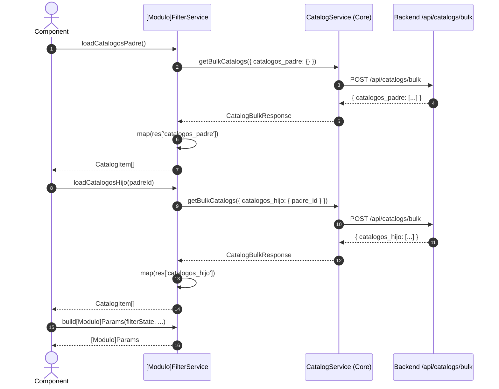

# Guía del Desarrollador: Crear un Módulo Feature desde Cero

**Usando Staff como Referencia — Angular v21 + PrimeNG v21 + Tailwind CSS v4**

---

## 1. Introducción y Contexto

### ¿Qué es un Feature Module en UyuniAdmin?

Un **Feature Module** es una unidad funcional independiente dentro del directorio `src/app/features/`. Cada feature encapsula sus propios modelos, servicios, componentes y rutas, siguiendo el patrón **DDD Lite / Modular Monolith**.

Los features se cargan de forma **lazy** (bajo demanda), lo que significa que su código solo se descarga cuando el usuario navega a esa sección. Esto optimiza el tiempo de carga inicial de la aplicación.

### Arquitectura del Proyecto



### Convenciones Generales

| Convención | Regla |
|------------|-------|
| **Path Aliases** | `@core/*`, `@shared/*`, `@features/*` — NUNCA imports relativos profundos |
| **Inyección** | `inject()` — NUNCA `constructor()` para servicios |
| **Estado** | Angular `signal()` / `computed()` — NUNCA variables sueltas |
| **Change Detection** | `ChangeDetectionStrategy.OnPush` — OBLIGATORIO en todos los componentes |
| **Idioma UI** | Español — Todo texto visible al usuario debe estar en español |
| **Logging** | `LoggerService` — NUNCA `console.log` en código de producción |
| **Tipos** | Estrictos — NUNCA `any` |
| **Tailwind** | v4 syntax — `!` como sufijo (ej: `py-1!`) |

---

## 2. Automatización: Script Generador de Features (¡NUEVO!)

Para agilizar la creación de módulos, hemos creado un script en Node.js que **clona un feature existente, renombra los archivos y carpetas, y reemplaza automáticamente los nombres de variables, clases y modelos**.

### Uso del Comando

Desde la raíz del proyecto (`/opt/uyuni/uyuni-frontend-ng`), ejecuta el siguiente comando:

```bash
node scripts/create-feature.js <feature-origen> <feature-destino> <entidad-destino>
```

**Ejemplo para crear `users` basándose en `staff`:**
```bash
node scripts/create-feature.js staff users user
```

**¿Qué hace este comando?**
1. Copia toda la carpeta `src/app/features/staff/` a `src/app/features/users/`.
2. Renombra todos los archivos que contengan `staff` (ej: `staff.model.ts` pasa a `user.model.ts`, `staff-list.component.ts` pasa a `user-list.component.ts`).
3. Renombra las subcarpetas si aplicara.
4. Entra a cada archivo y reemplaza inteligentemente el texto respetando las mayúsculas/minúsculas:
   - `staff` ➡️ `user`
   - `Staff` ➡️ `User`
   - `STAFF` ➡️ `USER`
5. Modifica automáticamente `src/app/app.routes.ts` agregando la ruta del nuevo feature mediante `loadChildren` si aún no estaba registrada.

**Importante sobre la nomenclatura (Plural vs Singular):**
- El **feature-destino** (`users`) debe ser en plural (es el nombre de la carpeta principal que agrupa todo).
- La **entidad-destino** (`user`) debe ser en singular (es la que se usa para los nombres de componentes, modelos y variables).

---

## 3. Adaptación Manual Post-Generación: Comparativa Staff vs Users

Aunque el script `create-feature.js` realiza el renombrado y copiado inicial, **no puede deducir la lógica de negocio ni la estructura de datos específica de la nueva entidad**. Aquí comparamos la estructura de la plantilla (`staff`) con el caso real adaptado (`users`) para ilustrar qué debe modificar manualmente el desarrollador al crear un feature diferente.

### 3.1. Diferencias de Dominio y Flujo de Filtros

| Aspecto | Feature Staff (Plantilla) | Feature Users (Caso Real) |
|:---|:---|:---|
| **Tipo de Filtros** | Jerárquicos y Dinámicos | Planos y Estáticos (Locales) |
| **Origen de Opciones** | Backend vía `CatalogService` (`/api/catalogs/bulk`) | Constantes estáticas en el componente frontend |
| **Relaciones/Cascada** | Gerencia ➡️ Departamento (En cascada) | Filtros independientes (Estado, Verificación, Tipo) |
| **Parámetro API** | `org_unit_id`, `is_active` | `is_active`, `is_verified`, `is_superuser` |

### 3.2. Comparativa de Modelos (`models/`)

El modelo generado por el script inicialmente conserva las propiedades de `Staff`. Debes actualizar el archivo `models/user.model.ts` con el JSON real que retorne la API del backend.

```carousel
```typescript
// ❌ ANTES (Heredado de Staff tras el script)
export interface User {
  id: string;
  first_name?: string;
  last_name_1?: string;
  last_name_2?: string;
  full_name: string;
  email: string;
  cellphone: string;
  management_name: string;
  department_name: string;
  birth_date: string;
  is_active: boolean;
  staff_type?: string;
  position_id?: string;
  org_unit_id?: string;
}

export interface UserParams {
  offset?: number;
  limit?: number;
  search?: string;
  sort_by?: string;
  sort_order?: 'asc' | 'desc';
  is_active?: boolean;
  org_unit_id?: string;
}
```
<!-- slide -->
```typescript
// ✅ DESPUÉS (Mapeado al JSON real de User)
export interface User {
  id: string;
  username: string;
  email: string;
  first_name: string;
  last_name: string;
  is_verified: boolean;
  is_active: boolean;
  is_superuser: boolean;
  created_at: string | null;
  updated_at: string | null;
  created_by_id: string | null;
  updated_by_id: string | null;
}

export interface UserParams {
  offset?: number;
  limit?: number;
  search?: string;
  sort_by?: string;
  sort_order?: 'asc' | 'desc';
  is_active?: boolean;
  is_verified?: boolean;
  is_superuser?: boolean;
}
```
```

### 3.3. Comparativa del Servicio de Filtros (`services/`)

Dado que `Users` no posee catálogos dinámicos jerárquicos, simplificamos el servicio de filtros eliminando la inyección de `CatalogService` y definiendo un estado de filtros local plano.

```carousel
```typescript
// ❌ ANTES (Filtros en cascada de Staff)
export interface UserFilterState {
  gerencias: CatalogItem[];
  departamentos: CatalogItem[];
  selectedGerencia: string | null;
  selectedDepartamento: string | null;
  selectedActivo: boolean | null;
}

@Injectable({ providedIn: 'root' })
export class UserFilterService {
  private readonly catalogService = inject(CatalogService);

  loadGerencias(): Observable<CatalogItem[]> { ... }
  loadDepartamentos(gerenciaId: string | null): Observable<CatalogItem[]> { ... }
  
  buildUserParams(filterState: UserFilterState, ...): UserParams {
    return {
      ...,
      org_unit_id: filterState.selectedDepartamento || filterState.selectedGerencia || undefined,
      is_active: filterState.selectedActivo !== null ? filterState.selectedActivo! : undefined
    };
  }
}
```
<!-- slide -->
```typescript
// ✅ DESPUÉS (Filtros planos y específicos de User)
export interface UserFilterState {
  selectedActivo: boolean | null;
  selectedSuperuser: boolean | null;
  selectedVerified: boolean | null;
}

@Injectable({ providedIn: 'root' })
export class UserFilterService {
  private readonly logger = inject(LoggerService);

  buildUserParams(
    filterState: UserFilterState,
    search: string,
    offset: number,
    limit: number,
    sortField?: string,
    sortOrder?: number
  ): UserParams {
    this.logger.debug('Building user params from filter state', { filterState, search }, 'UserFilterService');
    
    return {
      offset,
      limit,
      search: search || undefined,
      sort_by: sortField ? sortField.toString() : undefined,
      sort_order: sortField ? (sortOrder === 1 ? 'asc' : 'desc') : undefined,
      is_active: filterState.selectedActivo !== null ? filterState.selectedActivo! : undefined,
      is_verified: filterState.selectedVerified !== null ? filterState.selectedVerified! : undefined,
      is_superuser: filterState.selectedSuperuser !== null ? filterState.selectedSuperuser! : undefined
    };
  }
}
```
```

### 3.4. Comparativa del Componente Page (`pages/`)

En el componente inteligente (`user-list.component.ts`), la adaptación manual incluye:
1. **Remover observables e inicializaciones de catálogos** (`ngOnInit`, `loadGerencias`, `onGerenciaChange`).
2. **Definir constantes estáticas de opciones** para los `<p-select>` booleanos (`activoOptions`, `superuserOptions`, `verifiedOptions`).
3. **Mapear e importar los iconos Lucide requeridos** en la sección `imports` del decorador del componente (ej: `LucideMail`, `LucideShield`, `LucideCircleCheck`, `LucideCircleAlert` en lugar de `LucidePhone` y `LucideCalendar`).
4. **Adaptar `getInitials(user)`** para que maneje el formato de nombre del usuario o el fallback a `username` si no están definidos.

```typescript
// ❌ ANTES (Mapeo de iniciales basado en Staff)
getInitials(staff: Staff): string {
  const firstInitial = staff.first_name?.charAt(0).toUpperCase() || '';
  let lastInitial = '';
  if (staff.last_name_1) lastInitial = staff.last_name_1.charAt(0).toUpperCase();
  else if (staff.last_name_2) lastInitial = staff.last_name_2.charAt(0).toUpperCase();
  ...
  return firstInitial + lastInitial;
}

// ✅ DESPUÉS (Mapeo de iniciales basado en User)
getInitials(user: User): string {
  const firstInitial = user.first_name?.charAt(0).toUpperCase() || '';
  const lastInitial = user.last_name?.charAt(0).toUpperCase() || '';
  
  if (!firstInitial && !lastInitial && user.username) {
    return user.username.slice(0, 2).toUpperCase();
  }
  return `${firstInitial}${lastInitial}`;
}
```

### 3.5. Comparativa de la Plantilla HTML (`pages/`)

El HTML debe reescribirse para vincular los filtros planos definidos en el FilterState y estructurar las columnas según el nuevo modelo:

- **Filtros Independientes**: Se cambian los selectores encadenados por `<p-select>` directos mapeados a las opciones booleanas.
- **Formato del Nombre / Avatar**: Se utiliza el avatar con las iniciales adaptadas y se renderiza el nombre completo + el nombre de usuario (ej: `@admin`).
- **Uso de Directivas `@if` y Badges**: Se agregan etiquetas de rol condicionales (como un tag naranja para `Superusuario` con icono de escudo `LucideShield`) y estados de verificación visualmente ricos:

```html
<!-- Ejemplo de renderizado de celda de verificación con Lucide Icons en user-list.component.html -->
<td class="vertical-align-middle">
  @if (user.is_verified) {
    <span class="inline-flex items-center gap-1.5 text-green-600 dark:text-green-400 font-medium">
      <svg lucideCircleCheck size="16"></svg>
      <span>Verificado</span>
    </span>
  } @else {
    <span class="inline-flex items-center gap-1.5 text-amber-600 dark:text-amber-400 font-medium">
      <svg lucideCircleAlert size="16"></svg>
      <span>Pendiente</span>
    </span>
  }
</td>
```

---

## 4. Visión General del Resultado Final (Staff como Ejemplo)

### Arquitectura del Feature Staff



### Descripción Visual del Resultado

La página de Personal muestra:

- **Header**: Título "Personal" + barra de búsqueda con debounce
- **Barra de filtros**: Grid responsivo (1→2→4 columnas) con selectores cascada (Gerencia → Departamento → Estado) + botón "Limpiar Filtros"
- **Tabla de datos**: Lazy loading, paginación (15/20/30/50), sortable, con avatar + iniciales, email con ícono, celular con ícono, gerencia/departamento jerárquico, fecha nacimiento, tag de estado (Activo/Inactivo), botón editar
- **Empty message**: "No se encontró personal con los criterios buscados."

### Lista Completa de Archivos

| Archivo | Propósito |
|---------|-----------|
| `models/staff.model.ts` | Interfaces `Staff` y `StaffParams` |
| `services/staff.service.ts` | Servicio HTTP con CRUD + `loadPage()` con `forkJoin` |
| `services/staff-filter.service.ts` | Servicio de filtros con catálogos y cascada |
| `pages/staff-list/staff-list.component.ts` | Componente page (smart) con signals y debounce |
| `pages/staff-list/staff-list.component.html` | Plantilla con tabla, filtros y búsqueda |
| `pages/staff-list/staff-list.component.css` | Estilos mínimos (`:host { display: block; }`) |
| `staff.routes.ts` | Rutas lazy del feature |

### Flujo de Datos Completo



---

## 5. Paso 1 — Planificación del Módulo

Antes de escribir código, define claramente:

### Definir el Dominio

1. **Entidad principal**: ¿Qué representa el módulo? (ej: Staff = personal de la organización)
2. **Campos**: ¿Qué datos muestra la tabla? ¿Cuáles son ordenables?
3. **Relaciones**: ¿Hay dependencias jerárquicas? (ej: Gerencia → Departamento)
4. **Catálogos**: ¿Qué selectores de filtro necesita? ¿Cuáles son dependientes?
5. **Endpoints**: ¿Qué endpoints del backend son necesarios?

### Ejemplo: Cómo se planificó Staff

| Aspecto | Decisión |
|---------|----------|
| **Entidad** | Staff (personal de la organización) |
| **Campos tabla** | full_name, email, cellphone, management_name, department_name, position_name, birth_date, is_active |
| **Campos ordenables** | full_name, email, cellphone, birth_date, is_active |
| **Filtros** | Gerencia (catálogo), Departamento (cascada desde Gerencia), Estado (Activo/Inactivo) |
| **Cascada** | Gerencia → Departamento → org_unit_id en la API |
| **Endpoints** | `GET /api/core/staff/` (lista), `GET /api/core/staff/count` (conteo) |
| **Catálogos** | `gerencias`, `departamentos` (vía `CatalogService.getBulkCatalogs()`) |

> [!TIP]
> Dedicar 15 minutos a planificar evita horas de refactorización. Escribe la lista de campos, filtros y endpoints en un papel o documento antes de empezar a codificar.

---

## 6. Paso 2 — Crear la Estructura de Carpetas

### Comandos CLI

Reemplaza `[modulo]` con el nombre de tu feature en kebab-case (ej: `staff`, `fixed-assets`, `payroll`):

```bash
# Navegar al directorio de features
cd src/app/features

# Crear estructura de carpetas
mkdir -p [modulo]/models
mkdir -p [modulo]/services
mkdir -p [modulo]/pages/[modulo]-list

# Crear archivos
touch [modulo]/models/[modulo].model.ts
touch [modulo]/services/[modulo].service.ts
touch [modulo]/services/[modulo]-filter.service.ts
touch [modulo]/pages/[modulo]-list/[modulo]-list.component.ts
touch [modulo]/pages/[modulo]-list/[modulo]-list.component.html
touch [modulo]/pages/[modulo]-list/[modulo]-list.component.css
touch [modulo]/[modulo].routes.ts
```

### Ejemplo real con Staff

```bash
cd src/app/features

mkdir -p staff/models
mkdir -p staff/services
mkdir -p staff/pages/staff-list

touch staff/models/staff.model.ts
touch staff/services/staff.service.ts
touch staff/services/staff-filter.service.ts
touch staff/pages/staff-list/staff-list.component.ts
touch staff/pages/staff-list/staff-list.component.html
touch staff/pages/staff-list/staff-list.component.css
touch staff/staff.routes.ts
```

### Estructura Resultante

```
features/[modulo]/
├── models/
│   └── [modulo].model.ts          # Interfaces de entidad y parámetros
├── services/
│   ├── [modulo].service.ts        # Servicio HTTP (CRUD + loadPage)
│   └── [modulo]-filter.service.ts  # Servicio de filtros y catálogos
├── pages/
│   └── [modulo]-list/
│       ├── [modulo]-list.component.ts    # Componente page (smart)
│       ├── [modulo]-list.component.html  # Plantilla HTML
│       └── [modulo]-list.component.css   # Estilos mínimos
└── [modulo].routes.ts             # Rutas lazy del feature
```

### Convención de Nombres

| Tipo | Sufijo | Ejemplo |
|------|--------|---------|
| Modelo | `.model.ts` | `staff.model.ts` |
| Servicio | `.service.ts` | `staff.service.ts` |
| Servicio de filtros | `-filter.service.ts` | `staff-filter.service.ts` |
| Componente | `.component.ts` | `staff-list.component.ts` |
| Plantilla | `.component.html` | `staff-list.component.html` |
| Estilos | `.component.css` | `staff-list.component.css` |
| Rutas | `.routes.ts` | `staff.routes.ts` |

---

## 7. Paso 3 — Definir los Modelos (`models/[modulo].model.ts`)

El archivo de modelos define las interfaces TypeScript que tipan toda la comunicación entre servicio, componente y template.

### Patrón Genérico

```typescript
// features/[modulo]/models/[modulo].model.ts

export interface [Modulo] {
  id: string;
  // Campos de la entidad en snake_case (convención del backend)
  // Campos opcionales llevan ?
}

export interface [Modulo]Params {
  offset?: number;
  limit?: number;
  search?: string;
  sort_by?: string;
  sort_order?: 'asc' | 'desc';
  // Filtros específicos del módulo
}
```

### Ejemplo Real: Staff

```typescript
// features/staff/models/staff.model.ts

export interface Staff {
  id: string;
  first_name?: string;
  last_name_1?: string;
  last_name_2?: string;
  full_name: string;
  email: string;
  cellphone: string;
  management_name: string;
  department_name: string;
  birth_date: string;
  is_active: boolean;
  staff_type?: string;
  position_id?: string;
  org_unit_id?: string;
}

export interface StaffParams {
  offset?: number;
  limit?: number;
  search?: string;
  sort_by?: string;
  sort_order?: 'asc' | 'desc';
  is_active?: boolean;
  org_unit_id?: string;
}
```

### Reglas

| Regla | Descripción |
|-------|-------------|
| **snake_case** | Los campos deben coincidir con los del backend (Python/Django usa snake_case) |
| **Campos opcionales con `?`** | Solo marcar como opcional si el backend puede no enviar el campo |
| **NUNCA `any`** | Usar tipos estrictos para todos los campos |
| **Params por separado** | La interfaz de parámetros siempre va separada de la entidad |

> [!IMPORTANT]
> La interfaz `[Modulo]Params` es el contrato entre el FilterService y el Service HTTP. Cada filtro que envíes al backend debe tener su campo correspondiente aquí.

---

## 8. Paso 4 — Crear el Servicio HTTP (`services/[modulo].service.ts`)

El servicio HTTP maneja toda la comunicación con el backend. Usa `inject()` para dependencias, `ConfigService` para la URL base, y `LoggerService` para logging estructurado.

### Patrón Genérico

```typescript
// features/[modulo]/services/[modulo].service.ts

import { HttpClient, HttpParams } from '@angular/common/http';
import { inject, Injectable } from '@angular/core';

import { forkJoin, map, Observable } from 'rxjs';

import { ConfigService } from '@core/config/config.service';
import { LoggerService } from '@core/services/logger.service';

import { [Modulo], [Modulo]Params } from '../models/[modulo].model';

@Injectable({
  providedIn: 'root'
})
export class [Modulo]Service {
  private readonly http = inject(HttpClient);
  private readonly configService = inject(ConfigService);
  private readonly logger = inject(LoggerService);

  private readonly baseUrl = `${this.configService.apiUrl}/core/[modulo]/`;

  private buildHttpParams(params: [Modulo]Params): HttpParams {
    let httpParams = new HttpParams();

    if (params.offset !== undefined) httpParams = httpParams.set('offset', params.offset.toString());
    if (params.limit !== undefined) httpParams = httpParams.set('limit', params.limit.toString());
    if (params.search) httpParams = httpParams.set('search', params.search);
    if (params.sort_by) httpParams = httpParams.set('sort_by', params.sort_by);
    if (params.sort_order) httpParams = httpParams.set('sort_order', params.sort_order);
    // ... filtros específicos

    return httpParams;
  }

  getItems(params: [Modulo]Params): Observable<[Modulo][]> {
    const httpParams = this.buildHttpParams(params);
    this.logger.debug('Fetching [modulo] list', { params }, '[Modulo]Service');
    return this.http.get<[Modulo][]>(this.baseUrl, { params: httpParams });
  }

  getCount(params: [Modulo]Params): Observable<number> {
    const httpParams = this.buildHttpParams(params);
    this.logger.debug('Fetching [modulo] count', { params }, '[Modulo]Service');
    return this.http.get<{ total: number }>(`${this.baseUrl}count`, { params: httpParams }).pipe(
      map(response => response.total)
    );
  }

  loadPage(params: [Modulo]Params): Observable<{ data: [Modulo][], total: number }> {
    return forkJoin({
      data: this.getItems(params),
      total: this.getCount(params)
    }).pipe(
      map(result => {
        this.logger.info('[Modulo] page loaded', { count: result.data.length, total: result.total }, '[Modulo]Service');
        return result;
      })
    );
  }
}
```

### Ejemplo Real: StaffService

```typescript
// features/staff/services/staff.service.ts

import { HttpClient, HttpParams } from '@angular/common/http';
import { inject, Injectable } from '@angular/core';

import { forkJoin, map, Observable } from 'rxjs';

import { ConfigService } from '@core/config/config.service';
import { LoggerService } from '@core/services/logger.service';

import { Staff, StaffParams } from '../models/staff.model';

@Injectable({
  providedIn: 'root'
})
export class StaffService {
  private readonly http = inject(HttpClient);
  private readonly configService = inject(ConfigService);
  private readonly logger = inject(LoggerService);

  private readonly baseUrl = `${this.configService.apiUrl}/core/staff/`;

  private buildHttpParams(params: StaffParams): HttpParams {
    let httpParams = new HttpParams();

    if (params.offset !== undefined) httpParams = httpParams.set('offset', params.offset.toString());
    if (params.limit !== undefined) httpParams = httpParams.set('limit', params.limit.toString());
    if (params.search) httpParams = httpParams.set('search', params.search);
    if (params.sort_by) httpParams = httpParams.set('sort_by', params.sort_by);
    if (params.sort_order) httpParams = httpParams.set('sort_order', params.sort_order);
    if (params.is_active !== undefined) httpParams = httpParams.set('is_active', params.is_active.toString());
    if (params.org_unit_id !== undefined) httpParams = httpParams.set('org_unit_id', params.org_unit_id);

    return httpParams;
  }

  getStaff(params: StaffParams): Observable<Staff[]> {
    const httpParams = this.buildHttpParams(params);
    this.logger.debug('Fetching staff list', { params }, 'StaffService');
    return this.http.get<Staff[]>(this.baseUrl, { params: httpParams });
  }

  getStaffCount(params: StaffParams): Observable<number> {
    const httpParams = this.buildHttpParams(params);
    this.logger.debug('Fetching staff count', { params }, 'StaffService');
    return this.http.get<{ total: number }>(`${this.baseUrl}count`, { params: httpParams }).pipe(
      map(response => response.total)
    );
  }

  loadStaffPage(params: StaffParams): Observable<{ data: Staff[], total: number }> {
    return forkJoin({
      data: this.getStaff(params),
      total: this.getStaffCount(params)
    }).pipe(
      map(result => {
        this.logger.info('Staff page loaded', { count: result.data.length, total: result.total }, 'StaffService');
        return result;
      })
    );
  }
}
```

### Diagrama de Secuencia: Component → Service → API



### Puntos Clave del Servicio

| Punto | Explicación |
|-------|-------------|
| `buildHttpParams()` | Convierte `Params` → `HttpParams` de Angular. Solo agrega parámetros definidos (no `undefined`). |
| `forkJoin` | Ejecuta datos y conteo **en paralelo**, reduciendo el tiempo de carga a la mitad. |
| `map(response.total)` | Extrae el número del objeto `{ total: number }` que devuelve el endpoint de conteo. |
| `providedIn: 'root'` | Singleton global. No necesita ser declarado en ningún módulo. |
| `ConfigService.apiUrl` | URL base configurable desde `config.json`. NUNCA hardcodear URLs. |

---

## 9. Paso 5 — Crear el Servicio de Filtros (`services/[modulo]-filter.service.ts`)

### ¿Cuándo crear un FilterService separado?

Crea un FilterService cuando tu módulo tiene:

- **Catálogos/filtros jerárquicos** (ej: Gerencia → Departamento)
- **Lógica de traducción** de estado de filtros → parámetros de API
- **Múltiples catálogos** que necesitan cargarse desde `CatalogService`

Si tu módulo solo tiene búsqueda simple sin filtros, puedes omitir el FilterService e integrar la lógica directamente en el componente.

### Patrón Genérico

```typescript
// features/[modulo]/services/[modulo]-filter.service.ts

import { inject, Injectable } from '@angular/core';

import { Observable, of } from 'rxjs';
import { map, tap } from 'rxjs/operators';

import { CatalogItem } from '@core/models/catalog.model';
import { CatalogService } from '@core/services/catalog.service';
import { LoggerService } from '@core/services/logger.service';

import { [Modulo]Params } from '../models/[modulo].model';

export interface [Modulo]FilterState {
  // Catálogos cargados
  catalogosPadre: CatalogItem[];
  catalogosHijo: CatalogItem[];
  // Filtros seleccionados
  selectedPadre: string | null;
  selectedHijo: string | null;
}

@Injectable({
  providedIn: 'root'
})
export class [Modulo]FilterService {
  private readonly catalogService = inject(CatalogService);
  private readonly logger = inject(LoggerService);

  loadCatalogosPadre(): Observable<CatalogItem[]> {
    this.logger.debug('Loading catálogos padre', {}, '[Modulo]FilterService');

    return this.catalogService.getBulkCatalogs({ catalogos_padre: {} }).pipe(
      map((res) => res['catalogos_padre'] || []),
      tap((items) => {
        this.logger.debug('Catálogos padre loaded', { count: items.length }, '[Modulo]FilterService');
      })
    );
  }

  loadCatalogosHijo(padreId: string | null): Observable<CatalogItem[]> {
    this.logger.debug('Loading catálogos hijo', { padreId }, '[Modulo]FilterService');

    if (!padreId) {
      return of([]);
    }

    return this.catalogService.getBulkCatalogs({
      catalogos_hijo: {
        padre_id: padreId
      }
    }).pipe(
      map((res) => res['catalogos_hijo'] || []),
      tap((items) => {
        this.logger.debug('Catálogos hijo loaded', { count: items.length }, '[Modulo]FilterService');
      })
    );
  }

  build[Modulo]Params(
    filterState: [Modulo]FilterState,
    search: string,
    offset: number,
    limit: number,
    sortField?: string,
    sortOrder?: number
  ): [Modulo]Params {
    return {
      offset,
      limit,
      search: search || undefined,
      sort_by: sortField ? sortField.toString() : undefined,
      sort_order: sortField ? (sortOrder === 1 ? 'asc' : 'desc') : undefined,
      // Traducción de filtros a parámetros de API específicos
    };
  }
}
```

### Ejemplo Real: StaffFilterService

```typescript
// features/staff/services/staff-filter.service.ts

import { inject, Injectable } from '@angular/core';

import { Observable, of } from 'rxjs';
import { map, tap } from 'rxjs/operators';

import { CatalogItem } from '@core/models/catalog.model';
import { CatalogService } from '@core/services/catalog.service';
import { LoggerService } from '@core/services/logger.service';

import { StaffParams } from '../models/staff.model';

export interface StaffFilterState {
  gerencias: CatalogItem[];
  departamentos: CatalogItem[];
  selectedGerencia: string | null;
  selectedDepartamento: string | null;
  selectedActivo: boolean | null;
}

@Injectable({
  providedIn: 'root'
})
export class StaffFilterService {
  private readonly catalogService = inject(CatalogService);
  private readonly logger = inject(LoggerService);

  loadGerencias(): Observable<CatalogItem[]> {
    this.logger.debug('Loading gerencias', {}, 'StaffFilterService');

    return this.catalogService.getBulkCatalogs({ gerencias: {} }).pipe(
      map((res) => res['gerencias'] || []),
      tap((gerencias) => {
        this.logger.debug('Gerencias loaded', { count: gerencias.length }, 'StaffFilterService');
      })
    );
  }

  loadDepartamentos(gerenciaId: string | null): Observable<CatalogItem[]> {
    this.logger.debug('Loading departamentos', { gerenciaId }, 'StaffFilterService');

    if (!gerenciaId) {
      return of([]);
    }

    return this.catalogService.getBulkCatalogs({
      departamentos: {
        gerencia_id: gerenciaId
      }
    }).pipe(
      map((res) => res['departamentos'] || []),
      tap((departamentos) => {
        this.logger.debug('Departamentos loaded', { count: departamentos.length }, 'StaffFilterService');
      })
    );
  }

  resetDepartmentFilters(): StaffFilterState {
    return {
      gerencias: [],
      departamentos: [],
      selectedGerencia: null,
      selectedDepartamento: null,
      selectedActivo: null
    };
  }

  buildStaffParams(
    filterState: StaffFilterState,
    search: string,
    offset: number,
    limit: number,
    sortField?: string,
    sortOrder?: number
  ): StaffParams {
    return {
      offset,
      limit,
      search: search || undefined,
      sort_by: sortField ? sortField.toString() : undefined,
      sort_order: sortField ? (sortOrder === 1 ? 'asc' : 'desc') : undefined,
      org_unit_id: filterState.selectedDepartamento || filterState.selectedGerencia || undefined,
      is_active: filterState.selectedActivo !== null ? filterState.selectedActivo! : undefined
    };
  }
}
```

### Diagrama de Secuencia: FilterService → CatalogService → API



### Diagrama de Cascada de Filtros

```
┌──────────────────────────────────────────────────────────┐
│                  FILTROS EN CASCADA                       │
├──────────────────────────────────────────────────────────┤
│                                                          │
│  Gerencia (catálogo raíz)                                │
│  ┌─────────────────┐                                     │
│  │  selectedGerencia│──────┐                              │
│  └─────────────────┘      │                              │
│                           ▼                              │
│  Departamento (catálogo hijo)                            │
│  ┌──────────────────────┐  Carga solo si hay Gerencia   │
│  │  selectedDepartamento │──┐  [disabled] si !gerencia   │
│  └──────────────────────┘  │                              │
│                             ▼                              │
│  Resolución org_unit_id:                                  │
│  ┌─────────────────────────────────────────────────┐     │
│  │  org_unit_id = departamento || gerencia || null  │     │
│  └─────────────────────────────────────────────────┘     │
│                             │                              │
│                             ▼                              │
│  Envío a StaffService.loadStaffPage(params)              │
│                                                          │
└──────────────────────────────────────────────────────────┘
```

> [!NOTE]
> Para detalles completos sobre el sistema de catálogos bulk, consulta [`catalogs_bulk_guide.md`](./catalogs_bulk_guide.md).

---

## 10. Paso 6 — Configurar las Rutas (`[modulo].routes.ts` + `app.routes.ts`)

### Archivo de Rutas del Feature

```typescript
// features/[modulo]/[modulo].routes.ts

import { Routes } from '@angular/router';

export const routes: Routes = [
  {
    path: '',
    loadComponent: () => import('./pages/[modulo]-list/[modulo]-list.component').then(m => m.[Modulo]ListComponent),
    title: '[Título en Español] | Enterprise Admin'
  }
];
```

### Ejemplo Real: staff.routes.ts

```typescript
// features/staff/staff.routes.ts

import { Routes } from '@angular/router';

export const routes: Routes = [
  {
    path: '',
    loadComponent: () => import('./pages/staff-list/staff-list.component').then(m => m.StaffListComponent),
    title: 'Personal | Enterprise Admin'
  }
];
```

### Registrar en `app.routes.ts`

> [!NOTE]
> El script `create-feature.js` registra automáticamente la ruta utilizando `loadChildren` en `src/app/app.routes.ts` al final de la lista de subrutas. Solo debes realizar este paso de forma manual si decides reorganizar o cambiar la estructura.

Si necesitas registrarlo manualmente, debes agregar la ruta del feature dentro del bloque de hijos del `AppLayoutComponent` (protegido por `authGuard`):

```typescript
// src/app/app.routes.ts — agregar dentro del children del layout

{
  path: '[modulo]',
  loadChildren: () => import('@features/[modulo]/[modulo].routes').then(m => m.routes),
},
```

### Ejemplo Real: Entrada de Staff en app.routes.ts

```typescript
// src/app/app.routes.ts

import { Routes } from '@angular/router';
import { authGuard } from '@core/guards/auth.guard';
import { AppLayoutComponent } from '@shared/layout/app-layout/app-layout.component';

export const routes: Routes = [
  {
    path: '',
    component: AppLayoutComponent,
    canActivate: [authGuard],
    children: [
      {
        path: '',
        loadChildren: () => import('@features/dashboard/dashboard.routes').then(m => m.routes),
      },
      // ... otras rutas ...
      {
        path: 'staff',
        loadChildren: () => import('@features/staff/staff.routes').then(m => m.routes),
      },
    ]
  },
  // ... rutas de auth y 404
];
```

> [!IMPORTANT]
> Usa `loadChildren` (NO `loadComponent`) en `app.routes.ts` para rutas de feature. Esto permite que el archivo de rutas del feature defina múltiples sub-rutas en el futuro sin cambiar `app.routes.ts`.

---

## 11. Paso 7 — Crear el Componente Page (`pages/[modulo]-list/[modulo]-list.component.ts`)

El componente page es un **Smart Component** que orquesta los servicios, maneja el estado con signals, y delega la presentación al template.

### Patrón Genérico

```typescript
// features/[modulo]/pages/[modulo]-list/[modulo]-list.component.ts

import { CommonModule } from '@angular/common';
import { ChangeDetectionStrategy, Component, inject, OnInit, signal } from '@angular/core';
import { takeUntilDestroyed } from '@angular/core/rxjs-interop';
import { FormsModule } from '@angular/forms';

import { Button } from 'primeng/button';
import { IconField } from 'primeng/iconfield';
import { InputIcon } from 'primeng/inputicon';
import { InputText } from 'primeng/inputtext';
import { Select } from 'primeng/select';
import { TableLazyLoadEvent, TableModule } from 'primeng/table';
import { Tag } from 'primeng/tag';
import { Subject } from 'rxjs';
import { debounceTime, distinctUntilChanged } from 'rxjs/operators';

import { CatalogItem } from '@core/models/catalog.model';
import { LoggerService } from '@core/services/logger.service';

import { [Modulo] } from '../../models/[modulo].model';
import { [Modulo]Service } from '../../services/[modulo].service';
import { [Modulo]FilterService, [Modulo]FilterState } from '../../services/[modulo]-filter.service';

@Component({
  selector: 'app-[modulo]-list',
  standalone: true,
  imports: [
    CommonModule,
    FormsModule,
    TableModule,
    Tag,
    Button,
    InputText,
    IconField,
    InputIcon,
    Select,
  ],
  templateUrl: './[modulo]-list.component.html',
  styleUrls: ['./[modulo]-list.component.css'],
  changeDetection: ChangeDetectionStrategy.OnPush
})
export class [Modulo]ListComponent implements OnInit {
  private readonly [modulo]Service = inject([Modulo]Service);
  private readonly filterService = inject([Modulo]FilterService);
  private readonly logger = inject(LoggerService);

  // State Signals
  [modulo]List = signal<[Modulo][]>([]);
  totalRecords = signal<number>(0);
  isLoading = signal<boolean>(false);
  first = signal<number>(0);
  rows = signal<number>(15);

  // Search subject for debouncing
  private readonly searchSubject = new Subject<string>();
  searchValue = signal<string>('');

  // Catalog and filter signals
  catalogosPadre = signal<CatalogItem[]>([]);
  catalogosHijo = signal<CatalogItem[]>([]);
  selectedPadre = signal<string | null>(null);
  selectedHijo = signal<string | null>(null);

  constructor() {
    this.searchSubject.pipe(
      debounceTime(400),
      distinctUntilChanged(),
      takeUntilDestroyed()
    ).subscribe(value => {
      this.searchValue.set(value);
      this.first.set(0);
      this.loadData({ first: 0, rows: this.rows() });
    });
  }

  ngOnInit(): void {
    this.loadCatalogosPadre();
  }

  loadCatalogosPadre(): void {
    this.filterService.loadCatalogosPadre().subscribe({
      next: (items) => this.catalogosPadre.set(items),
      error: (err: Error) => this.logger.error('Error loading catálogos', err, '[Modulo]ListComponent')
    });
  }

  onPadreChange(padreId: string | null): void {
    this.selectedPadre.set(padreId);

    if (padreId) {
      this.filterService.loadCatalogosHijo(padreId).subscribe({
        next: (items) => {
          this.catalogosHijo.set(items);
          this.selectedHijo.set(null);
        },
        error: (err: Error) => this.logger.error('Error loading catálogos hijo', err, '[Modulo]ListComponent')
      });
    } else {
      this.catalogosHijo.set([]);
      this.selectedHijo.set(null);
    }

    this.resetAndReload();
  }

  onHijoChange(hijoId: string | null): void {
    this.selectedHijo.set(hijoId);
    this.resetAndReload();
  }

  clearFilters(): void {
    this.selectedPadre.set(null);
    this.selectedHijo.set(null);
    this.catalogosHijo.set([]);
    this.resetAndReload();
  }

  private resetAndReload(): void {
    this.first.set(0);
    this.loadData({ first: 0, rows: this.rows() });
  }

  loadData(event: TableLazyLoadEvent | { first: number, rows: number }): void {
    this.isLoading.set(true);

    const newFirst = event.first ?? 0;
    const newRows = event.rows ?? 15;

    this.first.set(newFirst);
    this.rows.set(newRows);

    const filterState: [Modulo]FilterState = {
      catalogosPadre: this.catalogosPadre(),
      catalogosHijo: this.catalogosHijo(),
      selectedPadre: this.selectedPadre(),
      selectedHijo: this.selectedHijo(),
    };

    let sortField: string | undefined;
    let sortOrder: number | undefined;

    if ('sortField' in event) {
      sortField = event.sortField?.toString();
      sortOrder = event.sortOrder ?? undefined;
    }

    const params = this.filterService.build[Modulo]Params(
      filterState,
      this.searchValue(),
      newFirst,
      newRows,
      sortField,
      sortOrder
    );

    this.[modulo]Service.loadPage(params).subscribe({
      next: (result) => {
        this.[modulo]List.set(result.data);
        this.totalRecords.set(result.total);
        this.isLoading.set(false);
      },
      error: (err: Error) => {
        this.logger.error('Error loading data', err, '[Modulo]ListComponent');
        this.isLoading.set(false);
      }
    });
  }

  onSearch(event: Event): void {
    const value = (event.target as HTMLInputElement).value;
    this.searchSubject.next(value);
  }
}
```
### Ejemplo Real: StaffListComponent

```typescript
// features/staff/pages/staff-list/staff-list.component.ts

import { CommonModule } from '@angular/common';
import { ChangeDetectionStrategy, Component, inject, OnInit, signal } from '@angular/core';
import { takeUntilDestroyed } from '@angular/core/rxjs-interop';
import { FormsModule } from '@angular/forms';

import { Avatar } from 'primeng/avatar';
import { Button } from 'primeng/button';
import { IconField } from 'primeng/iconfield';
import { InputIcon } from 'primeng/inputicon';
import { InputText } from 'primeng/inputtext';
import { Select } from 'primeng/select';
import { TableLazyLoadEvent, TableModule } from 'primeng/table';
import { Tag } from 'primeng/tag';
import { Tooltip } from 'primeng/tooltip';
import { Subject } from 'rxjs';
import { debounceTime, distinctUntilChanged } from 'rxjs/operators';
import { LucideCalendar, LucideMail, LucidePhone } from '@lucide/angular';

import { CatalogItem } from '@core/models/catalog.model';
import { LoggerService } from '@core/services/logger.service';

import { Staff } from '../../models/staff.model';
import { StaffService } from '../../services/staff.service';
import { StaffFilterService, StaffFilterState } from '../../services/staff-filter.service';

@Component({
  selector: 'app-staff-list',
  standalone: true,
  imports: [
    CommonModule, FormsModule, TableModule, Tag, Avatar, Button,
    InputText, IconField, InputIcon, Tooltip, Select,
    LucidePhone, LucideMail, LucideCalendar
  ],
  templateUrl: './staff-list.component.html',
  styleUrls: ['./staff-list.component.css'],
  changeDetection: ChangeDetectionStrategy.OnPush
})
export class StaffListComponent implements OnInit {
  private readonly staffService = inject(StaffService);
  private readonly filterService = inject(StaffFilterService);
  private readonly logger = inject(LoggerService);

  staffList = signal<Staff[]>([]);
  totalRecords = signal<number>(0);
  isLoading = signal<boolean>(false);
  first = signal<number>(0);
  rows = signal<number>(15);

  private readonly searchSubject = new Subject<string>();
  searchValue = signal<string>('');

  gerencias = signal<CatalogItem[]>([]);
  departamentos = signal<CatalogItem[]>([]);
  selectedGerencia = signal<string | null>(null);
  selectedDepartamento = signal<string | null>(null);
  selectedActivo = signal<boolean | null>(null);

  readonly activoOptions = [
    { label: 'Activo', value: true },
    { label: 'Inactivo', value: false }
  ];

  constructor() {
    this.searchSubject.pipe(
      debounceTime(400),
      distinctUntilChanged(),
      takeUntilDestroyed()
    ).subscribe(value => {
      this.searchValue.set(value);
      this.first.set(0);
      this.loadData({ first: 0, rows: this.rows() });
    });
  }

  ngOnInit(): void { this.loadGerencias(); }

  loadGerencias(): void {
    this.filterService.loadGerencias().subscribe({
      next: (gerencias) => this.gerencias.set(gerencias),
      error: (err: Error) => this.logger.error('Error loading gerencias', err, 'StaffListComponent')
    });
  }

  onGerenciaChange(gerenciaId: string | null): void {
    this.selectedGerencia.set(gerenciaId);
    if (gerenciaId) {
      this.filterService.loadDepartamentos(gerenciaId).subscribe({
        next: (departamentos) => {
          this.departamentos.set(departamentos);
          this.selectedDepartamento.set(null);
        },
        error: (err: Error) => this.logger.error('Error loading departamentos', err, 'StaffListComponent')
      });
    } else {
      this.departamentos.set([]);
      this.selectedDepartamento.set(null);
    }
    this.resetAndReload();
  }

  onDepartamentoChange(deptId: string | null): void {
    this.selectedDepartamento.set(deptId);
    this.resetAndReload();
  }

  onActivoChange(isActive: boolean | null): void {
    this.selectedActivo.set(isActive);
    this.resetAndReload();
  }

  clearFilters(): void {
    this.selectedGerencia.set(null);
    this.selectedDepartamento.set(null);
    this.selectedActivo.set(null);
    this.departamentos.set([]);
    this.resetAndReload();
  }

  private resetAndReload(): void {
    this.first.set(0);
    this.loadData({ first: 0, rows: this.rows() });
  }

  loadData(event: TableLazyLoadEvent | { first: number; rows: number }): void {
    this.isLoading.set(true);
    const newFirst = event.first ?? 0;
    const newRows = event.rows ?? 15;
    this.first.set(newFirst);
    this.rows.set(newRows);

    const filterState: StaffFilterState = {
      gerencias: this.gerencias(),
      departamentos: this.departamentos(),
      selectedGerencia: this.selectedGerencia(),
      selectedDepartamento: this.selectedDepartamento(),
      selectedActivo: this.selectedActivo()
    };

    let sortField: string | undefined;
    let sortOrder: number | undefined;
    if ('sortField' in event) {
      sortField = event.sortField?.toString();
      sortOrder = event.sortOrder ?? undefined;
    }

    const params = this.filterService.buildStaffParams(
      filterState, this.searchValue(), newFirst, newRows, sortField, sortOrder
    );

    this.staffService.loadStaffPage(params).subscribe({
      next: (result) => {
        this.staffList.set(result.data);
        this.totalRecords.set(result.total);
        this.isLoading.set(false);
      },
      error: (err: Error) => {
        this.logger.error('Error loading staff data', err, 'StaffListComponent');
        this.isLoading.set(false);
      }
    });
  }

  onSearch(event: Event): void {
    const value = (event.target as HTMLInputElement).value;
    this.searchSubject.next(value);
  }

  getInitials(staff: Staff): string {
    const firstInitial = staff.first_name?.charAt(0).toUpperCase() || '';
    let lastInitial = '';
    if (staff.last_name_1) lastInitial = staff.last_name_1.charAt(0).toUpperCase();
    else if (staff.last_name_2) lastInitial = staff.last_name_2.charAt(0).toUpperCase();
    if (!firstInitial && !lastInitial && staff.full_name) {
      return staff.full_name.split(' ').filter(p => p.length > 0).map(n => n[0]).slice(0, 2).join('').toUpperCase();
    }
    return firstInitial + lastInitial;
  }
}
```

### Diagrama: Búsqueda con Debounce

```mermaid
flowchart LR
    A["Usuario escribe<br/>en el input"] --> B["(input) event<br/>→ onSearch()"]
    B --> C["searchSubject.next(value)"]
    C --> D["Subject<string>"]
    D --> E["debounceTime(400ms)"]
    E --> F["distinctUntilChanged()"]
    F --> G["takeUntilDestroyed()"]
    G --> H["subscribe()"]
    H --> I["searchValue.set(value)"]
    I --> J["first.set(0)"]
    J --> K["loadData()"]

    style A fill:#3b82f6,color:#fff
    style D fill:#f59e0b,color:#fff
    style E fill:#ef4444,color:#fff
    style K fill:#22c55e,color:#fff
```



### Puntos Clave del Componente

| Punto | Explicación |
|-------|-------------|
| `takeUntilDestroyed()` | Limpieza automática de la suscripción al destruir el componente. NUNCA usar `ngOnDestroy` para limpieza de observables. |
| `debounceTime(400)` | Espera 400ms sin escritura antes de disparar la búsqueda. Evita llamadas innecesarias al backend. |
| `distinctUntilChanged()` | Solo dispara si el valor cambió. Evita búsquedas duplicadas. |
| `resetAndReload()` | Patrón DRY: resetea paginación a 0 y recarga datos. Se usa en todos los cambios de filtro. |
| `TableLazyLoadEvent` | Tipo de PrimeNG que incluye `first`, `rows`, `sortField`, `sortOrder`. Se maneja en `loadData()`. |
| `signal()` | Todo el estado reactivo usa signals. Los cambios se propagan automáticamente al template. |

---

## 12. Paso 8 — Crear la Plantilla HTML (`pages/[modulo]-list/[modulo]-list.component.html`)

La plantilla sigue los estándares **Enterprise de Alta Densidad**: compacta, profesional, responsiva.

### Patrón Genérico (Estructura)

La plantilla tiene 4 secciones principales:

1. **Contenedor principal**: Card con bordes, bg y rounded
2. **Header**: Título + barra de búsqueda con debounce
3. **Barra de filtros**: Grid responsivo (1→2→4 columnas) con `<p-select>` y cascada
4. **Tabla de datos**: `<p-table>` con lazy loading, paginación, sortable

### Convenciones del Template

| Convención | Regla |
|------------|-------|
| **Contenedor** | `p-4 border rounded-xl bg-white dark:bg-gray-900` |
| **Título** | `text-lg font-bold` — NUNCA más grande que `text-lg` en páginas enterprise |
| **Búsqueda** | `p-iconfield` + `p-inputicon` + `pInputText` con `w-full md:w-20rem` |
| **Filtros** | Grid `grid-cols-1 sm:grid-cols-2 lg:grid-cols-4` dentro de `bg-gray-50 dark:bg-gray-900` |
| **Cada filtro** | `flex flex-col lg:flex-row lg:items-center` con label `whitespace-nowrap` |
| **Select** | `optionLabel="label" optionValue="value" [showClear]="true" appendTo="body"` |
| **Cascada** | `[disabled]="!selectedPadre()"` — Deshabilitado hasta que el padre tenga valor |
| **Tabla** | `[lazy]="true"` + `dense-table` class + `currentPageReportTemplate` en español |
| **Columnas sortable** | `pSortableColumn="field"` + `<p-sortIcon field="field">` |
| **Empty message** | Siempre en español, con `colspan` correcto |
| **`class` NO `styleClass`** | En PrimeNG v21+, usar `class` estándar, NUNCA `styleClass` (deprecado) |
| **Íconos Lucide** | `<svg lucideMail size="15">` para íconos en celdas de tabla |

> [!IMPORTANT]
> Todos los `<p-select>` dentro de filtros deben incluir `appendTo="body"`. Esto evita recortes por contenedor (`overflow-hidden`) y problemas de posicionamiento en diálogos y tablas.

> [!NOTE]
> Para catálogos con más de 10 elementos, agregar `[filter]="true" filterPlaceholder="Buscar..." filterBy="label"` para habilitar búsqueda dentro del dropdown.

---

## 13. Paso 9 — Estilos CSS (`pages/[modulo]-list/[modulo]-list.component.css`)

### Patrón

```css
/* features/[modulo]/pages/[modulo]-list/[modulo]-list.component.css */

:host {
  display: block;
}
```

### Ejemplo Real: staff-list.component.css

```css
/* features/staff/pages/staff-list/staff-list.component.css */

:host {
  display: block;
}
```

### Regla de Estilos

| Regla | Explicación |
|-------|-------------|
| **Mínimo CSS** | Solo `:host { display: block; }` es necesario |
| **Todo vía Tailwind** | Todo el styling se hace con utility classes en el template |
| **`dense-table`** | Clase global aplicada a `<p-table>` para tablas enterprise compactas |
| **Dark mode** | Usar clases `dark:` de Tailwind en el template (ej: `dark:bg-gray-900`) |

> [!TIP]
> Si necesitas estilos personalizados complejos que no se pueden lograr con Tailwind, usa `:host` para encapsular. Pero el 99% de los casos se resuelven con utility classes.

---

## 14. Paso 10 — Registrar el Icono en IconRegistryService

### Cómo funciona la resolución slug → icon

El sidebar del panel usa `IconRegistryService` para resolver slugs del backend a íconos Lucide. Cuando el backend envía un slug para tu nuevo módulo, debe existir un mapeo en el registro.

### Agregar el mapeo

Editar `src/app/shared/services/icon-registry.service.ts`:

```typescript
// En el Map SLUG_TO_ICON, agregar la entrada para el nuevo módulo:

private readonly SLUG_TO_ICON = new Map<string, LucideIconData>([
  // ... mapeos existentes ...
  ['[modulo]', Lucide[IconName].icon],  // ← Nueva entrada
]);
```

### Ejemplo Real: Mapear "staff"

```typescript
// En icon-registry.service.ts

import { LucideUsers } from '@lucide/angular';  // ← Importar el ícono

private readonly SLUG_TO_ICON = new Map<string, LucideIconData>([
  // ... mapeos existentes ...
  ['staff', LucideUsers.icon],  // ← slug "staff" → LucideUsers
]);
```

### Verificar

1. El backend debe enviar el slug `"staff"` en el menú lateral
2. El sidebar mostrará el ícono de `LucideUsers`
3. Si el slug no está mapeado, se mostrará `LucideCircleDot` (punto neutral) como fallback
4. Para diagnosticar: ejecutar `iconRegistry.printDiagnostics()` en la consola del navegador

> [!NOTE]
> Busca íconos disponibles en [https://lucide.dev/icons/](https://lucide.dev/icons/). Usa nombres de componentes v1.16 (ej: `LucideEllipsis` no `LucideMoreHorizontal`).

---

## 15. Paso 11 — Verificación y Pruebas

### Checklist de Verificación

Ejecuta cada uno de estos comandos y verificaciones:

```bash
# 1. Compilar sin errores
npm run build

# 2. Lint sin errores
npm run lint

# 3. Tests (si existen)
npm test
```

### Verificaciones Manuales

| Verificación | Cómo |
|-------------|------|
| **Lazy loading** | Abrir DevTools → Network tab → Navegar al módulo → Verificar que se carga un chunk nuevo |
| **Filtros cascada** | Seleccionar Gerencia → Departamento se habilita → Seleccionar Departamento → Tabla se filtra |
| **Paginación** | Navegar a página 2 → Cambiar filtro → Verificar que vuelve a página 1 |
| **Ordenamiento** | Click en columna sortable → Verificar orden asc/desc |
| **Búsqueda** | Escribir texto → Esperar 400ms → Verificar que se filtra |
| **Dark mode** | Cambiar a dark mode → Verificar que todos los colores se adaptan |
| **Responsividad** | Probar en móvil (< 640px), tablet (768px), escritorio (1024px+) |
| **Limpiar filtros** | Click "Limpiar Filtros" → Verificar que todos los selectores se resetean |
| **Empty message** | Buscar algo que no exista → Verificar mensaje en español |

---

## 16. Checklist Final del Desarrollador

### Requisitos Obligatorios

| # | Requisito | Estado |
|---|-----------|--------|
| 1 | `ChangeDetectionStrategy.OnPush` en el componente | ☐ |
| 2 | `inject()` para todos los servicios (NO constructor) | ☐ |
| 3 | `signal()` para todo el estado reactivo | ☐ |
| 4 | Path aliases (`@core/*`, `@shared/*`, `@features/*`) | ☐ |
| 5 | `LoggerService` en lugar de `console.log` | ☐ |
| 6 | Textos de UI en español | ☐ |
| 7 | Título de ruta en español | ☐ |
| 8 | `providedIn: 'root'` en servicios | ☐ |
| 9 | Tipos estrictos (NUNCA `any`) | ☐ |
| 10 | `takeUntilDestroyed()` para suscripciones en constructor | ☐ |
| 11 | `appendTo="body"` en todos los `<p-select>` | ☐ |
| 12 | `class` en vez de `styleClass` en PrimeNG | ☐ |
| 13 | Lazy loading configurado en `app.routes.ts` | ☐ |
| 14 | Icono registrado en `IconRegistryService` | ☐ |
| 15 | `build` pasa sin errores | ☐ |
| 16 | `lint` pasa sin errores | ☐ |

### Errores Comunes y Cómo Evitarlos

| Error | Síntoma | Solución |
|-------|---------|----------|
| Usar `styleClass` | Warning en consola: "styleClass is deprecated" | Reemplazar con `class` |
| Usar `constructor()` para inyección | Linter warning | Usar `inject()` |
| Falta `appendTo="body"` | Dropdown cortado o mal posicionado | Agregar `appendTo="body"` a `<p-select>` |
| Falta `takeUntilDestroyed()` | Memory leak al navegar fuera del componente | Agregar al pipe de suscripción |
| Usar `any` | Error de TypeScript strict | Definir interfaz específica |
| No resetear paginación | Pantalla en blanco al filtrar en página avanzada | Usar `resetAndReload()` |
| `console.log` en producción | Linter error | Usar `this.logger.info()` / `debug()` |
| Import relativo profundo | `../../../` en imports | Usar path alias `@core/*`, `@shared/*` |
| Falta `[filter]="true"` | Dropdown muy largo sin búsqueda | Agregar para catálogos > 10 items |
| Dark mode roto | Colores incorrectos en modo oscuro | Agregar clases `dark:` en template |

---

## 17. Extensibilidad

> **Próximamente**: Sección sobre cómo extender el módulo con operaciones CRUD (crear, editar, eliminar), formularios de detalle, y rutas adicionales dentro del feature.

---

*Última actualización: Mayo 2026 | UyuniAdmin v1.0.3 | Angular v21 + PrimeNG v21 + Tailwind CSS v4*
