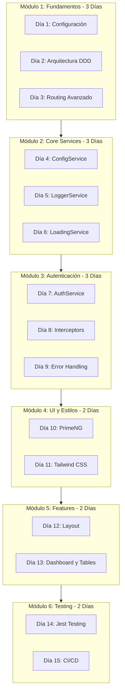
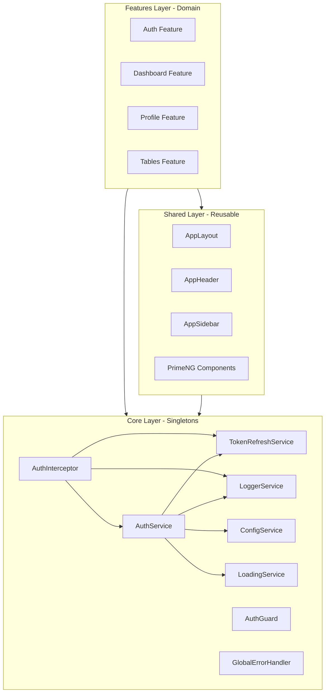

# Plan de Curso Completo: Desarrollo de Aplicaciones Enterprise con Angular 21

## Información General

| Aspecto | Detalle |
|---------|---------|
| **Nombre del Curso** | Desarrollo de Aplicaciones Enterprise con Angular 21 |
| **Proyecto Base** | UyuniAdmin Frontend |
| **Nivel** | Intermedio (menos de 1 año de experiencia en Angular) |
| **Duración Estimada** | 15 días (3 semanas) |
| **Modalidad** | Teórico-Práctico con proyecto real |
| **Requisitos Previos** | Conocimientos básicos de TypeScript, HTML, CSS |

---

## Objetivos del Curso

### Objetivo General
Capacitar a los participantes en el desarrollo de aplicaciones empresariales completas utilizando Angular 21, aplicando las mejores prácticas de arquitectura, patrones de diseño y herramientas modernas del ecosistema Angular.

### Objetivos Específicos
1. Dominar la arquitectura de componentes standalone y lazy loading
2. Implementar sistemas de autenticación robustos con JWT
3. Gestionar estado reactivo con Angular Signals
4. Crear interfaces de usuario profesionales con PrimeNG y Tailwind CSS
5. Aplicar patrones de diseño enterprise en proyectos reales
6. Implementar testing unitario y buenas prácticas de código
7. Manejar errores de red y estados de carga global
8. Integrar gráficos y visualizaciones de datos

---

## Estructura del Curso: 15 Días

### Módulo 1: Fundamentos y Arquitectura (Días 1-3)

#### Día 1: Introducción a Angular 21 y Configuración del Proyecto
- **Duración**: 4 horas
- **Temas**:
  1. Novedades de Angular 21 (Standalone Components por defecto)
  2. Configuración del entorno de desarrollo
  3. Estructura de un proyecto Angular enterprise
  4. Path Aliases y organización de imports
  5. Configuración de TypeScript strict mode

- **Práctica**:
  - Crear un nuevo proyecto Angular 21
  - Configurar path aliases (@core, @shared, @features)
  - Configurar ESLint y Prettier

- **Archivos de referencia**:
  - [`tsconfig.json`](../tsconfig.json)
  - [`angular.json`](../angular.json)
  - [`package.json`](../package.json)

#### Día 2: Arquitectura DDD Lite y Estructura Modular
- **Duración**: 4 horas
- **Temas**:
  1. Domain-Driven Design Lite aplicado a Angular
  2. Separación de responsabilidades: Core, Shared, Features
  3. Smart Components vs Dumb Components
  4. Lazy Loading por defecto
  5. ChangeDetectionStrategy.OnPush

- **Práctica**:
  - Crear estructura de carpetas siguiendo DDD Lite
  - Implementar primer módulo feature con lazy loading
  - Configurar routing con guards

- **Archivos de referencia**:
  - [`src/app/app.routes.ts`](../src/app/app.routes.ts)
  - [`src/app/app.config.ts`](../src/app/app.config.ts)
  - [`docs/ARCHITECTURE.md`](../docs/ARCHITECTURE.md)

#### Día 3: Routing Avanzado y Lazy Loading
- **Duración**: 4 horas
- **Temas**:
  1. Configuración de rutas con loadChildren y loadComponent
  2. Route Guards funcionales (CanActivateFn)
  3. Data y Resolve en rutas
  4. Lazy loading strategies
  5. Preloading strategies

- **Práctica**:
  - Configurar rutas lazy-loaded para múltiples features
  - Implementar guards de autenticación
  - Crear resolver para precarga de datos

- **Archivos de referencia**:
  - [`src/app/app.routes.ts`](../src/app/app.routes.ts)
  - [`src/app/core/guards/auth.guard.ts`](../src/app/core/guards/auth.guard.ts)
  - [`src/app/features/dashboard/dashboard.routes.ts`](../src/app/features/dashboard/dashboard.routes.ts)

---

### Módulo 2: Core - Servicios Globales (Días 4-6)

#### Día 4: ConfigService y APP_INITIALIZER
- **Duración**: 4 horas
- **Temas**:
  1. APP_INITIALIZER y carga de configuración
  2. HttpBackend para bypass de interceptors
  3. Sistema de configuración por ambiente
  4. Inyección de dependencias con inject()
  5. Signals para estado reactivo

- **Práctica**:
  - Implementar ConfigService con carga asíncrona
  - Crear archivo config.json con variables de entorno
  - Configurar providers en app.config.ts

- **Archivos de referencia**:
  - [`src/app/core/config/config.service.ts`](../src/app/core/config/config.service.ts)
  - [`src/app/core/config/config.model.ts`](../src/app/core/config/config.model.ts)
  - [`public/assets/config/config.example.json`](../public/assets/config/config.example.json)

#### Día 5: LoggerService y Sistema de Logging
- **Duración**: 4 horas
- **Temas**:
  1. Sistema de logging estructurado
  2. Niveles de log configurables
  3. Contexto y metadatos en logs
  4. Integración con ConfigService
  5. Diferencias entre desarrollo y producción

- **Práctica**:
  - Implementar LoggerService con niveles
  - Configurar minLevel desde config.json
  - Agregar contexto a los logs

- **Archivos de referencia**:
  - [`src/app/core/services/logger.service.ts`](../src/app/core/services/logger.service.ts)
  - [`src/app/core/services/logger.service.spec.ts`](../src/app/core/services/logger.service.spec.ts)

#### Día 6: LoadingService y Manejo de Estado Global
- **Duración**: 4 horas
- **Temas**:
  1. Contador de peticiones HTTP activas
  2. Debounce para evitar flicker en UI
  3. Fail-safe timeout para loaders atascados
  4. Integración con Router events
  5. BlockUI global en AppComponent

- **Práctica**:
  - Implementar LoadingService con contador robusto
  - Crear loading.interceptor.ts
  - Integrar spinner global en la aplicación

- **Archivos de referencia**:
  - [`src/app/core/services/loading.service.ts`](../src/app/core/services/loading.service.ts)
  - [`src/app/core/interceptors/loading.interceptor.ts`](../src/app/core/interceptors/loading.interceptor.ts)
  - [`src/app/app.component.ts`](../src/app/app.component.ts)

---

### Módulo 3: Sistema de Autenticación (Días 7-9)

#### Día 7: AuthService y Gestión de Tokens JWT
- **Duración**: 4 horas
- **Temas**:
  1. OAuth2 Password Grant con JWT
  2. Almacenamiento de tokens (localStorage vs cookies)
  3. Signals para estado de autenticación
  4. Login, logout y refresh token
  5. Manejo de roles y permisos

- **Práctica**:
  - Implementar AuthService con Signals
  - Crear modelos de autenticación
  - Implementar login y logout

- **Archivos de referencia**:
  - [`src/app/core/auth/auth.service.ts`](../src/app/core/auth/auth.service.ts)
  - [`src/app/features/auth/models/auth.models.ts`](../src/app/features/auth/models/auth.models.ts)
  - [`docs/AUTHENTICATION.md`](../docs/AUTHENTICATION.md)

#### Día 8: HTTP Interceptors - Autenticación
- **Duración**: 4 horas
- **Temas**:
  1. Functional Interceptors en Angular 21
  2. Inyección automática de Bearer tokens
  3. Header X-Active-Role para multi-tenant
  4. Manejo de errores HTTP
  5. Cola de peticiones durante refresh

- **Práctica**:
  - Implementar authInterceptor funcional
  - Inyectar tokens en requests
  - Manejar errores 401 y 403

- **Archivos de referencia**:
  - [`src/app/core/interceptors/auth.interceptor.ts`](../src/app/core/interceptors/auth.interceptor.ts)
  - [`src/app/core/interceptors/auth.interceptor.spec.ts`](../src/app/core/interceptors/auth.interceptor.spec.ts)

#### Día 9: Token Refresh y Error Handling
- **Duración**: 4 horas
- **Temas**:
  1. Silent token refresh on 401
  2. TokenRefreshService dedicado
  3. AuthErrorHandlerService centralizado
  4. NetworkErrorService para errores de red
  5. GlobalErrorHandler para errores no manejados

- **Práctica**:
  - Implementar TokenRefreshService
  - Crear AuthErrorHandlerService
  - Implementar NetworkErrorService

- **Archivos de referencia**:
  - [`src/app/core/services/token-refresh.service.ts`](../src/app/core/services/token-refresh.service.ts)
  - [`src/app/core/services/auth-error-handler.service.ts`](../src/app/core/services/auth-error-handler.service.ts)
  - [`src/app/core/services/network-error.service.ts`](../src/app/core/services/network-error.service.ts)
  - [`src/app/core/handlers/global-error-handler.ts`](../src/app/core/handlers/global-error-handler.ts)

---

### Módulo 4: UI y Estilos (Días 10-11)

#### Día 10: PrimeNG y Sistema de Temas
- **Duración**: 4 horas
- **Temas**:
  1. Configuración de PrimeNG v21
  2. Tema Aura y personalización
  3. Componentes standalone de PrimeNG
  4. Dark mode con PrimeNG
  5. Integración con Angular Signals

- **Práctica**:
  - Configurar PrimeNG con tema personalizado
  - Implementar componentes UI básicos
  - Crear toggle de dark mode

- **Archivos de referencia**:
  - [`src/app/app.config.ts`](../src/app/app.config.ts) (providePrimeNG)
  - [`src/app/features/auth/components/theme-toggle-two/`](../src/app/features/auth/components/theme-toggle-two/)
  - [`src/app/features/ui/`](../src/app/features/ui/)

#### Día 11: Tailwind CSS v4 y Design System
- **Duración**: 4 horas
- **Temas**:
  1. Tailwind CSS v4 con @theme directive
  2. Custom utilities y variants
  3. Design tokens para enterprise
  4. Integración PrimeNG + Tailwind
  5. Responsive design mobile-first

- **Práctica**:
  - Configurar Tailwind CSS v4
  - Crear design tokens personalizados
  - Implementar utilidades CSS custom

- **Archivos de referencia**:
  - [`src/styles.css`](../src/styles.css)
  - [`.postcssrc.json`](../.postcssrc.json)
  - [`tailwindcss-primeui` plugin](https://github.com/primefaces/tailwindcss-primeui)

---

### Módulo 5: Features y Componentes (Días 12-13)

#### Día 12: Layout y Navegación
- **Duración**: 4 horas
- **Temas**:
  1. AppLayoutComponent con sidebar y header
  2. SidebarService para estado colapsable
  3. Navegación dinámica basada en roles
  4. Breadcrumbs y page titles
  5. Skeleton loading para navegación

- **Práctica**:
  - Implementar layout principal
  - Crear sidebar colapsable
  - Implementar header con user dropdown

- **Archivos de referencia**:
  - [`src/app/shared/layout/app-layout/`](../src/app/shared/layout/app-layout/)
  - [`src/app/shared/layout/app-sidebar/`](../src/app/shared/layout/app-sidebar/)
  - [`src/app/shared/layout/app-header/`](../src/app/shared/layout/app-header/)

#### Día 13: Feature Modules - Dashboard y Tablas
- **Duración**: 4 horas
- **Temas**:
  1. Estructura de un feature module
  2. Smart Component (pages) vs Dumb Component (components)
  3. Integración de Chart.js
  4. PrimeNG Table con datos
  5. Comunicación entre componentes

- **Práctica**:
  - Crear feature module de dashboard
  - Implementar métricas y gráficos
  - Crear tabla de datos con PrimeNG

- **Archivos de referencia**:
  - [`src/app/features/dashboard/`](../src/app/features/dashboard/)
  - [`src/app/features/tables/`](../src/app/features/tables/)
  - [`src/app/features/charts/`](../src/app/features/charts/)

---

### Módulo 6: Testing y Buenas Prácticas (Días 14-15)

#### Día 14: Testing Unitario con Jest
- **Duración**: 4 horas
- **Temas**:
  1. Configuración de Jest en Angular
  2. Testing de servicios con Signals
  3. Testing de interceptors HTTP
  4. Testing de guards funcionales
  5. Coverage thresholds

- **Práctica**:
  - Configurar Jest en el proyecto
  - Escribir tests para AuthService
  - Crear tests para interceptors y guards

- **Archivos de referencia**:
  - [`jest.config.js`](../jest.config.js)
  - [`src/app/core/auth/auth.service.spec.ts`](../src/app/core/auth/auth.service.spec.ts)
  - [`src/app/core/interceptors/auth.interceptor.spec.ts`](../src/app/core/interceptors/auth.interceptor.spec.ts)
  - [`docs/UNIT_TESTING_GUIDE.md`](../docs/UNIT_TESTING_GUIDE.md)

#### Día 15: Calidad de Código y CI/CD
- **Duración**: 4 horas
- **Temas**:
  1. ESLint con angular-eslint
  2. Husky y lint-staged para pre-commit hooks
  3. Convenciones de código
  4. Documentación con JSDoc
  5. Preparación para producción

- **Práctica**:
  - Configurar Husky + lint-staged
  - Implementar pre-commit hooks
  - Documentar código con JSDoc
  - Build de producción

- **Archivos de referencia**:
  - [`eslint.config.js`](../eslint.config.js)
  - [`.husky/`](../.husky/)
  - [`docs/HUSKY_LINT_STAGED_GUIDE.md`](../docs/HUSKY_LINT_STAGED_GUIDE.md)
  - [`docs/CLEAN_CODE_IMPROVEMENTS.md`](../docs/CLEAN_CODE_IMPROVEMENTS.md)

---

## Diagrama de Arquitectura del Curso



---

## Flujo de Dependencias del Proyecto



---

## Proyecto Práctico: Mini UyuniAdmin

Durante el curso, los participantes construirán un proyecto práctico que incluya:

### Entregables por Módulo

| Módulo | Entregable |
|--------|------------|
| 1 | Proyecto configurado con path aliases y estructura DDD |
| 2 | ConfigService, LoggerService y LoadingService funcionando |
| 3 | Sistema de login completo con JWT y guards |
| 4 | UI con PrimeNG, Tailwind y dark mode |
| 5 | Dashboard con métricas y tablas de datos |
| 6 | Tests unitarios y pre-commit hooks |

### Requisitos del Proyecto Final

1. **Autenticación funcional** con JWT
2. **Dashboard** con al menos 3 métricas y 1 gráfico
3. **Tabla de datos** con ordenamiento y filtrado
4. **Dark mode** funcional
5. **Tests** con coverage > 70%
6. **Documentación** básica del código

---

## Detalle de Contenido por Día

### Día 1: Introducción a Angular 21

#### Teoría (1 hora)
- **Angular 21**: Última versión con mejoras de rendimiento
- **Standalone Components**: Ya no necesitamos NgModules
- **Strict Mode**: TypeScript configurado para máxima seguridad
- **Path Aliases**: Evitar el "infierno de puntos" en imports

#### Demo (1 hora)
```typescript
// Ejemplo de configuración de path aliases en tsconfig.json
{
  "compilerOptions": {
    "paths": {
      "@core/*": ["src/app/core/*"],
      "@shared/*": ["src/app/shared/*"],
      "@features/*": ["src/app/features/*"]
    }
  }
}
```

#### Práctica (2 horas)
1. Crear proyecto con `ng new`
2. Configurar `tsconfig.json` con path aliases
3. Crear estructura de carpetas inicial
4. Configurar ESLint

---

### Día 2: Arquitectura DDD Lite

#### Teoría (1 hora)
- **Domain-Driven Design**: Principios aplicados a frontend
- **Bounded Contexts**: Separación por dominios de negocio
- **Smart vs Dumb Components**: Responsabilidades claras
- **OnPush Strategy**: Optimización de change detection

#### Demo (1 hora)
```typescript
// Ejemplo de componente standalone con OnPush
@Component({
  selector: 'app-dashboard',
  standalone: true,
  changeDetection: ChangeDetectionStrategy.OnPush,
  imports: [CommonModule],
  templateUrl: './dashboard.component.html'
})
export class DashboardComponent {}
```

#### Práctica (2 horas)
1. Crear módulo Core con servicios base
2. Crear módulo Shared con componentes UI
3. Crear primer feature module con lazy loading
4. Implementar OnPush en todos los componentes

---

### Día 3: Routing Avanzado

#### Teoría (1 hora)
- **Lazy Loading**: Cargar módulos bajo demanda
- **Route Guards**: Proteger rutas con CanActivateFn
- **Route Data**: Pasar información estática a rutas
- **Resolvers**: Precargar datos antes de navegar

#### Demo (1 hora)
```typescript
// Ejemplo de routing con lazy loading y guards
export const routes: Routes = [
  {
    path: 'dashboard',
    loadChildren: () => import('@features/dashboard/dashboard.routes')
      .then(m => m.routes),
    canActivate: [authGuard]
  }
];
```

#### Práctica (2 horas)
1. Configurar rutas principales
2. Implementar authGuard funcional
3. Crear rutas lazy-loaded para features
4. Agregar títulos de página a las rutas

---

### Día 4: ConfigService

#### Teoría (1 hora)
- **APP_INITIALIZER**: Ejecutar código antes del bootstrap
- **HttpBackend**: Bypass de interceptors para configuración
- **Configuración por ambiente**: Diferentes configs para dev/prod
- **Signals**: Estado reactivo sin RxJS

#### Demo (1 hora)
```typescript
// Ejemplo de ConfigService con HttpBackend
@Injectable({ providedIn: 'root' })
export class ConfigService {
  private handler = inject(HttpBackend);
  private http = new HttpClient(this.handler);
  
  private configSignal = signal<AppConfig | null>(null);
  readonly config = this.configSignal.asReadonly();
  
  loadConfig(): Promise<void> {
    return lastValueFrom(this.http.get<AppConfig>('assets/config/config.json'))
      .then(config => this.configSignal.set(config));
  }
}
```

#### Práctica (2 horas)
1. Crear ConfigService con HttpBackend
2. Configurar APP_INITIALIZER
3. Crear archivo config.json
4. Usar config en otros servicios

---

### Día 5: LoggerService

#### Teoría (1 hora)
- **Logging estructurado**: Mensajes con contexto y metadatos
- **Niveles de log**: debug, info, warn, error
- **Configuración dinámica**: Cambiar nivel según ambiente
- **Buenas prácticas**: Cuándo usar cada nivel

#### Demo (1 hora)
```typescript
// Ejemplo de LoggerService
@Injectable({ providedIn: 'root' })
export class LoggerService {
  private minLevel: LogLevel = 'info';
  
  setMinLevel(level: LogLevel): void {
    this.minLevel = level;
  }
  
  info(message: string, data?: unknown, context?: string): void {
    this.log('info', message, data, context);
  }
  
  error(message: string, error?: unknown, context?: string): void {
    this.log('error', message, error, context);
  }
}
```

#### Práctica (2 horas)
1. Implementar LoggerService con niveles
2. Integrar con ConfigService para nivel dinámico
3. Agregar contexto a los logs
4. Usar logger en lugar de console.log

---

### Día 6: LoadingService

#### Teoría (1 hora)
- **Contador de peticiones**: Evitar race conditions
- **Debounce**: Prevenir flicker en cargas rápidas
- **Fail-safe**: Timeout para loaders atascados
- **Router integration**: Reset en navegación

#### Demo (1 hora)
```typescript
// Ejemplo de LoadingService con contador
@Injectable({ providedIn: 'root' })
export class LoadingService {
  readonly isLoading = signal(false);
  private activeRequestCount = 0;
  
  showLoader(): void {
    this.activeRequestCount++;
    if (this.activeRequestCount === 1) {
      // Debounce para evitar flicker
      setTimeout(() => {
        if (this.activeRequestCount > 0) {
          this.isLoading.set(true);
        }
      }, 300);
    }
  }
  
  hideLoader(): void {
    this.activeRequestCount = Math.max(0, this.activeRequestCount - 1);
    if (this.activeRequestCount === 0) {
      this.isLoading.set(false);
    }
  }
}
```

#### Práctica (2 horas)
1. Implementar LoadingService con contador
2. Crear loading.interceptor.ts
3. Integrar con Router events
4. Mostrar spinner en AppComponent

---

### Día 7: AuthService

#### Teoría (1 hora)
- **OAuth2 Password Grant**: Flujo de autenticación
- **JWT**: Estructura y validación de tokens
- **Signals para auth state**: Estado reactivo
- **localStorage vs cookies**: Pros y contras

#### Demo (1 hora)
```typescript
// Ejemplo de AuthService con Signals
@Injectable({ providedIn: 'root' })
export class AuthService {
  private tokenSignal = signal<string | null>(localStorage.getItem('access_token'));
  private userSignal = signal<User | null>(null);
  
  readonly isAuthenticated = computed(() => !!this.tokenSignal());
  readonly currentUser = this.userSignal.asReadonly();
  
  login(credentials: LoginCredentials): Observable<TokenResponse> {
    return this.http.post<TokenResponse>(`${this.apiUrl}/auth/login`, credentials)
      .pipe(tap(response => this.setSession(response)));
  }
}
```

#### Práctica (2 horas)
1. Crear modelos de autenticación
2. Implementar AuthService con Signals
3. Crear métodos login y logout
4. Manejar estado de usuario

---

### Día 8: HTTP Interceptors

#### Teoría (1 hora)
- **Functional Interceptors**: Nueva API de Angular
- **Token injection**: Adjuntar Bearer token
- **Error handling**: Capturar errores HTTP
- **Request/Response modification**: Clonar requests

#### Demo (1 hora)
```typescript
// Ejemplo de authInterceptor funcional
export const authInterceptor: HttpInterceptorFn = (req, next) => {
  const authService = inject(AuthService);
  const token = authService.getToken();
  
  let authReq = req;
  if (token) {
    authReq = req.clone({
      setHeaders: { Authorization: `Bearer ${token}` }
    });
  }
  
  return next(authReq).pipe(
    catchError((error: HttpErrorResponse) => {
      if (error.status === 401) {
        // Handle token refresh
      }
      return throwError(() => error);
    })
  );
};
```

#### Práctica (2 horas)
1. Crear authInterceptor funcional
2. Inyectar tokens en requests
3. Manejar errores 401
4. Agregar header X-Active-Role

---

### Día 9: Error Handling

#### Teoría (1 hora)
- **Silent refresh**: Renovar token sin interrumpir usuario
- **TokenRefreshService**: Encapsular lógica de refresh
- **AuthErrorHandlerService**: Manejo centralizado
- **NetworkErrorService**: Detección de offline

#### Demo (1 hora)
```typescript
// Ejemplo de TokenRefreshService
@Injectable({ providedIn: 'root' })
export class TokenRefreshService {
  private isRefreshingSignal = signal(false);
  readonly isRefreshing = this.isRefreshingSignal.asReadonly();
  
  refreshToken(): Observable<string> {
    if (this.isRefreshing()) {
      return this.waitForToken();
    }
    this.isRefreshingSignal.set(true);
    return this.doRefresh();
  }
}
```

#### Práctica (2 horas)
1. Implementar TokenRefreshService
2. Crear AuthErrorHandlerService
3. Implementar NetworkErrorService
4. Integrar GlobalErrorHandler

---

### Día 10: PrimeNG

#### Teoría (1 hora)
- **PrimeNG v21**: Componentes enterprise
- **Tema Aura**: Design system moderno
- **Standalone imports**: Importar solo lo necesario
- **Dark mode**: Configuración con CSS selector

#### Demo (1 hora)
```typescript
// Configuración de PrimeNG en app.config.ts
providePrimeNG({
  ripple: true,
  theme: {
    preset: Aura,
    options: {
      darkModeSelector: '.dark',
      cssLayer: { name: 'primeng', order: 'base, primeng, components, utilities' }
    }
  }
})
```

#### Práctica (2 horas)
1. Configurar PrimeNG en app.config.ts
2. Importar componentes standalone
3. Crear formulario de login con PrimeNG
4. Implementar dark mode toggle

---

### Día 11: Tailwind CSS v4

#### Teoría (1 hora)
- **Tailwind CSS v4**: Nueva API con @theme
- **Design tokens**: Variables CSS personalizadas
- **Custom utilities**: Extender Tailwind
- **PrimeNG integration**: tailwindcss-primeui plugin

#### Demo (1 hora)
```css
/* Ejemplo de configuración en styles.css */
@theme {
  --font-roboto: Roboto, sans-serif;
  --color-brand-500: #734c19;
  --header-height: 64px;
  --sidebar-width: 280px;
}

@utility glass-header {
  @apply sticky top-0 backdrop-blur-md bg-white/80;
}
```

#### Práctica (2 horas)
1. Configurar Tailwind CSS v4
2. Crear design tokens
3. Implementar custom utilities
4. Integrar con PrimeNG

---

### Día 12: Layout

#### Teoría (1 hora)
- **AppLayoutComponent**: Estructura principal
- **SidebarService**: Estado colapsable
- **Responsive design**: Mobile-first
- **Skeleton loading**: UX durante carga

#### Demo (1 hora)
```typescript
// Ejemplo de AppLayoutComponent
@Component({
  selector: 'app-layout',
  standalone: true,
  imports: [AppHeader, AppSidebar, RouterModule],
  templateUrl: './app-layout.component.html'
})
export class AppLayoutComponent {
  private sidebarService = inject(SidebarService);
  
  readonly isExpanded = this.sidebarService.isExpanded;
  readonly isMobileOpen = this.sidebarService.isMobileOpen;
}
```

#### Práctica (2 horas)
1. Crear AppLayoutComponent
2. Implementar sidebar colapsable
3. Crear header con user dropdown
4. Agregar skeleton loading

---

### Día 13: Dashboard y Tablas

#### Teoría (1 hora)
- **Feature module structure**: Pages vs Components
- **Chart.js integration**: Gráficos interactivos
- **PrimeNG Table**: Ordenamiento y filtrado
- **Component communication**: Input/Output signals

#### Demo (1 hora)
```typescript
// Ejemplo de feature module structure
// dashboard/
// ├── pages/
// │   └── overview/
// │       └── ecommerce.component.ts (Smart)
// └── components/
//     ├── ecommerce-metrics/ (Dumb)
//     └── monthly-sales-chart/ (Dumb)
```

#### Práctica (2 horas)
1. Crear feature module de dashboard
2. Implementar métricas con Signals
3. Crear gráfico con Chart.js
4. Implementar tabla con PrimeNG

---

### Día 14: Testing con Jest

#### Teoría (1 hora)
- **Jest vs Karma**: Ventajas de Jest
- **Testing Signals**: Cómo testear signals
- **Testing interceptors**: Mock de HTTP
- **Testing guards**: TestBed.runInInjectionContext

#### Demo (1 hora)
```typescript
// Ejemplo de test con Jest
describe('AuthService', () => {
  let service: AuthService;
  
  beforeEach(() => {
    TestBed.configureTestingModule({});
    service = TestBed.inject(AuthService);
  });
  
  it('should be created', () => {
    expect(service).toBeTruthy();
  });
  
  it('should update isAuthenticated signal on login', () => {
    service.login({ username: 'test', password: 'test' });
    expect(service.isAuthenticated()).toBe(true);
  });
});
```

#### Práctica (2 horas)
1. Configurar Jest en el proyecto
2. Crear tests para AuthService
3. Crear tests para interceptors
4. Crear tests para guards

---

### Día 15: CI/CD y Calidad

#### Teoría (1 hora)
- **ESLint**: Reglas de linting
- **Husky**: Git hooks
- **lint-staged**: Lint solo archivos modificados
- **Pre-commit hooks**: Validar antes de commit

#### Demo (1 hora)
```json
// Ejemplo de configuración lint-staged
{
  "lint-staged": {
    "*.ts": ["eslint --fix", "git add"],
    "*.html": ["eslint --fix", "git add"]
  }
}
```

#### Práctica (2 horas)
1. Configurar Husky
2. Configurar lint-staged
3. Crear pre-commit hook
4. Ejecutar build de producción

---

## Recursos Adicionales

### Documentación del Proyecto
- [`docs/ARCHITECTURE.md`](../docs/ARCHITECTURE.md) - Arquitectura completa
- [`docs/AUTHENTICATION.md`](../docs/AUTHENTICATION.md) - Sistema de autenticación
- [`docs/UNIT_TESTING_GUIDE.md`](../docs/UNIT_TESTING_GUIDE.md) - Guía de testing
- [`.kilocode/rules/memory-bank/`](../.kilocode/rules/memory-bank/) - Memory bank completo

### Herramientas Necesarias
- Node.js 20+
- Angular CLI 21
- VS Code con extensiones Angular
- Git

### Librerías Principales
- Angular 21.1.0
- PrimeNG 21.0.3
- Tailwind CSS 4.1.11
- Jest 30.2.0
- Chart.js 4.5.1

---

## Metodología de Enseñanza

### Estructura de Cada Día

1. **Teoría (1 hora)**: Conceptos y explicaciones
2. **Demo (1 hora)**: Demostración en código real
3. **Práctica Guiada (1.5 horas)**: Ejercicios con asistencia
4. **Práctica Independiente (0.5 horas)**: Ejercicios individuales

### Evaluación

- **Ejercicios diarios**: 40% de la nota
- **Proyecto final**: 40% de la nota
- **Participación**: 20% de la nota

---

## Próximos Pasos

1. **Aprobación del Plan**: Revisar y aprobar este documento
2. **Creación de Contenido**: Generar materiales detallados para cada día
3. **Ejercicios Prácticos**: Diseñar ejercicios y soluciones
4. **Grabación/Documentación**: Crear contenido final

---

*Plan creado: Marzo 2026*
*Basado en: UyuniAdmin Frontend v1.0.2*
*Duración: 15 días (3 semanas)*
