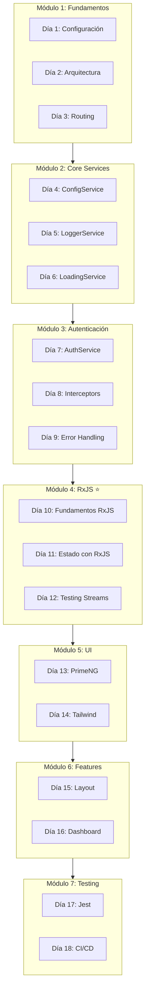

# Plan Maestro: Curso de Angular 21 Enterprise

## Metadatos del Curso

| Aspecto | Detalle |
|---------|---------|
| **Nombre del Curso** | Desarrollo de Aplicaciones Enterprise con Angular 21 |
| **Código** | ANG21-ENT-2026 |
| **Versión** | 1.0.0 |
| **Proyecto Base** | UyuniAdmin Frontend v1.0.2 |
| **Nivel** | Intermedio (menos de 1 año de experiencia) |
| **Duración** | 18 días (3.5 semanas) |
| **Horas Totales** | 72 horas (4h/día) |
| **Modalidad** | Teórico-Práctico con proyecto real |

---

## Estructura de Carpetas del Curso

```
curso/
└── v1.0.0-angular21/
    ├── README.md                         # Overview del curso
    ├── PLAN-GENERAL.md                   # Este documento
    ├── dia-01-fundamentos/
    │   ├── README.md                     # Guía del día
    │   ├── contenido.md                  # Contenido teórico extenso
    │   ├── slides/
    │   │   └── presentacion.md           # Marp slides
    │   ├── ejercicios/
    │   │   ├── lab-01.md                 # Práctica guiada
    │   │   ├── lab-02.md                 # Práctica independiente
    │   │   └── solucion/                 # Código solución
    │   ├── assessment/
    │   │   └── preguntas.md              # 50 preguntas múltiple choice
    │   └── recursos/
    │       ├── bibliografia.md           # Enlaces y referencias
    │       ├── cheatsheet.md             # Resumen rápido
    │       ├── script-audio.md           # Guion para podcast/narración
    │       └── script-video-youtube.md   # Guion para video YouTube
    ├── dia-02-arquitectura/
    │   └── ... (misma estructura)
    ├── ...
    ├── dia-18-proyecto-final/
    │   └── ...
    └── proyecto-ejemplo/
        └── mini-uyuniadmin/              # Proyecto completo de referencia
```

---

## Materiales por Día (Estándar de Industria)

### 1. **README.md** (Guía del Día)
- Objetivos de aprendizaje
- Prerrequisitos
- Agenda del día
- Tiempo estimado por actividad

### 2. **contenido.md** (Contenido Teórico)
- Explicación extensa y didáctica
- Ejemplos de código comentados
- Diagramas en Mermaid
- Notas y advertencias
- Comparativas y tablas

### 3. **slides/presentacion.md** (Marp)
- Presentación visual para proyectar
- Máximo 30 slides por día
- Código embebido con syntax highlighting
- Diagramas visuales

### 4. **ejercicios/** (Prácticas)
- **lab-XX.md**: Instrucciones paso a paso
- **solucion/**: Código completo funcional
- Tiempo estimado de resolución

### 5. **assessment/preguntas.md**
- 50 preguntas de selección múltiple
- Respuestas correctas marcadas
- Explicación de cada respuesta
- Dificultad: básica, intermedia, avanzada

### 6. **recursos/**
- **bibliografia.md**: Enlaces oficiales, blogs, videos
- **cheatsheet.md**: Resumen de una página
- **script-audio.md**: Guion para podcast/narración

---

## Estructura del Curso: 18 Días

### Módulo 1: Fundamentos y Arquitectura (Días 1-3)

#### Día 1: Introducción a Angular 21 y Configuración
- **Temas**: Novedades Angular 21, entorno de desarrollo, path aliases, TypeScript strict
- **Archivos referencia**: [`tsconfig.json`](../tsconfig.json), [`angular.json`](../angular.json)

#### Día 2: Arquitectura DDD Lite y Estructura Modular
- **Temas**: DDD aplicado a Angular, Core/Shared/Features, Smart vs Dumb, OnPush
- **Archivos referencia**: [`docs/ARCHITECTURE.md`](../docs/ARCHITECTURE.md)

#### Día 3: Routing Avanzado y Lazy Loading
- **Temas**: loadChildren, loadComponent, guards funcionales, resolvers
- **Archivos referencia**: [`src/app/app.routes.ts`](../src/app/app.routes.ts)

---

### Módulo 2: Core Services (Días 4-6)

#### Día 4: ConfigService y APP_INITIALIZER
- **Temas**: Carga de configuración, HttpBackend, inyección con inject()
- **Archivos referencia**: [`src/app/core/config/config.service.ts`](../src/app/core/config/config.service.ts)

#### Día 5: LoggerService y Sistema de Logging
- **Temas**: Logging estructurado, niveles configurables, contexto
- **Archivos referencia**: [`src/app/core/services/logger.service.ts`](../src/app/core/services/logger.service.ts)

#### Día 6: LoadingService y Estado Global
- **Temas**: Contador de peticiones, debounce, fail-safe, Router integration
- **Archivos referencia**: [`src/app/core/services/loading.service.ts`](../src/app/core/services/loading.service.ts)

---

### Módulo 3: Sistema de Autenticación (Días 7-9)

#### Día 7: AuthService y Gestión de Tokens JWT
- **Temas**: OAuth2 Password Grant, JWT, Signals para auth state
- **Archivos referencia**: [`src/app/core/auth/auth.service.ts`](../src/app/core/auth/auth.service.ts)

#### Día 8: HTTP Interceptors - Autenticación
- **Temas**: Functional interceptors, token injection, error handling
- **Archivos referencia**: [`src/app/core/interceptors/auth.interceptor.ts`](../src/app/core/interceptors/auth.interceptor.ts)

#### Día 9: Error Handling y Token Refresh
- **Temas**: Silent refresh, TokenRefreshService, GlobalErrorHandler
- **Archivos referencia**: [`src/app/core/services/token-refresh.service.ts`](../src/app/core/services/token-refresh.service.ts)

---

### Módulo 4: RxJS y Estado Avanzado (Días 10-12) ⭐ NUEVO

#### Día 10: Fundamentos de RxJS
- **Temas**: 
  - Observables vs Signals: cuándo usar cada uno
  - Operators más usados: map, filter, switchMap, mergeMap
  - Subjects: BehaviorSubject, ReplaySubject
  - AsyncPipe y sus ventajas
- **Archivos referencia**: Uso de RxJS en [`auth.service.ts`](../src/app/core/auth/auth.service.ts)

#### Día 11: Patrones de Estado con RxJS
- **Temas**:
  - State management sin librerías externas
  - Patrón Repository con RxJS
  - Manejo de streams complejos
  - Combinando Signals + RxJS
- **Archivos referencia**: [`TokenRefreshService`](../src/app/core/services/token-refresh.service.ts)

#### Día 12: Testing de Streams RxJS
- **Temas**:
  - Marble testing
  - TestScheduler y fake timers
  - Testing de Observables en servicios
  - Mocking de HTTP calls
- **Archivos referencia**: [`auth.service.spec.ts`](../src/app/core/auth/auth.service.spec.ts)

---

### Módulo 5: UI y Estilos (Días 13-14)

#### Día 13: PrimeNG y Sistema de Temas
- **Temas**: PrimeNG v21, tema Aura, dark mode, standalone imports
- **Archivos referencia**: [`src/app/app.config.ts`](../src/app/app.config.ts)

#### Día 14: Tailwind CSS v4 y Design System
- **Temas**: @theme directive, design tokens, custom utilities, PrimeNG integration
- **Archivos referencia**: [`src/styles.css`](../src/styles.css)

---

### Módulo 6: Features y Componentes (Días 15-16)

#### Día 15: Layout y Navegación
- **Temas**: AppLayout, SidebarService, responsive design, skeleton loading
- **Archivos referencia**: [`src/app/shared/layout/`](../src/app/shared/layout/)

#### Día 16: Dashboard y Visualizaciones
- **Temas**: Feature structure, Chart.js, PrimeNG Table, Input/Output signals
- **Archivos referencia**: [`src/app/features/dashboard/`](../src/app/features/dashboard/)

---

### Módulo 7: Testing y CI/CD (Días 17-18)

#### Día 17: Testing Unitario con Jest
- **Temas**: Jest config, testing Signals, testing interceptors, coverage
- **Archivos referencia**: [`jest.config.js`](../jest.config.js), [`docs/UNIT_TESTING_GUIDE.md`](../docs/UNIT_TESTING_GUIDE.md)

#### Día 18: CI/CD y Proyecto Final
- **Temas**: Husky, lint-staged, pre-commit hooks, build producción
- **Archivos referencia**: [`.husky/`](../.husky/), [`docs/HUSKY_LINT_STAGED_GUIDE.md`](../docs/HUSKY_LINT_STAGED_GUIDE.md)

---

## Diagrama de Módulos



---

## Proyecto Práctico: Mini UyuniAdmin

### Entregables por Módulo

| Módulo | Entregable | Días |
|--------|------------|------|
| 1 | Proyecto con path aliases y estructura DDD | 1-3 |
| 2 | ConfigService, LoggerService, LoadingService | 4-6 |
| 3 | Sistema de login JWT completo | 7-9 |
| 4 | Manejo de estado con RxJS + Signals | 10-12 |
| 5 | UI con PrimeNG, Tailwind, dark mode | 13-14 |
| 6 | Dashboard con métricas y tablas | 15-16 |
| 7 | Tests unitarios + CI/CD | 17-18 |

### Requisitos del Proyecto Final

1. ✅ Autenticación JWT funcional
2. ✅ Dashboard con 3+ métricas y 1 gráfico
3. ✅ Tabla de datos con ordenamiento/filtrado
4. ✅ Dark mode funcional
5. ✅ Tests con coverage > 70%
6. ✅ Pre-commit hooks configurados
7. ✅ Manejo de errores global
8. ✅ Documentación JSDoc

---

## Materiales Adicionales por Día

### Script de Audio (Podcast/Narración)
Cada día incluye un guion para generar contenido de audio:
- Duración: 15-20 minutos
- Formato: Conversacional, como podcast técnico
- Incluye: Explicaciones, ejemplos, tips

### Guion de Video (Tutorial)
Para grabar videos tutoriales:
- Duración: 30-45 minutos
- Formato: Screencast con voz en off
- Incluye: Demo en vivo, explicación de código

### Banco de Preguntas (Assessment)
- 50 preguntas por día
- Tipos: Conceptual, Práctico, Debugging
- Niveles: Básico (20), Intermedio (20), Avanzado (10)
- Formato: Selección múltiple con 4 opciones

---

## Metodología de Enseñanza

### Estructura de Cada Día (4 horas)

| Bloque | Duración | Actividad |
|--------|----------|-----------|
| 1 | 1h | Teoría con slides |
| 2 | 1h | Demo en vivo |
| 3 | 1.5h | Práctica guiada |
| 4 | 0.5h | Práctica independiente |

### Evaluación

| Componente | Peso | Descripción |
|------------|------|-------------|
| Ejercicios diarios | 30% | Labs completados |
| Proyecto final | 40% | Mini UyuniAdmin funcional |
| Assessment | 20% | Preguntas de selección |
| Participación | 10% | Q&A y discusiones |

---

## Recursos del Proyecto Base

### Documentación
- [`docs/ARCHITECTURE.md`](../docs/ARCHITECTURE.md)
- [`docs/AUTHENTICATION.md`](../docs/AUTHENTICATION.md)
- [`docs/UNIT_TESTING_GUIDE.md`](../docs/UNIT_TESTING_GUIDE.md)
- [`.kilocode/rules/memory-bank/`](../.kilocode/rules/memory-bank/)

### Código Fuente
- Core Services: [`src/app/core/`](../src/app/core/)
- Features: [`src/app/features/`](../src/app/features/)
- Shared: [`src/app/shared/`](../src/app/shared/)
- Tests: [`*.spec.ts`](../src/app/)

---

## Próximos Pasos

1. ✅ Plan general aprobado
2. ⏳ Crear estructura de carpetas `curso/v1.0.0-angular21/`
3. ⏳ Generar contenido del Día 1 completo
4. ⏳ Generar contenido de los 18 días
5. ⏳ Crear proyecto ejemplo Mini UyuniAdmin

---

*Plan actualizado: Marzo 2026*
*Versión: 1.0.0*
*Duración: 18 días (incluye módulo RxJS)*
