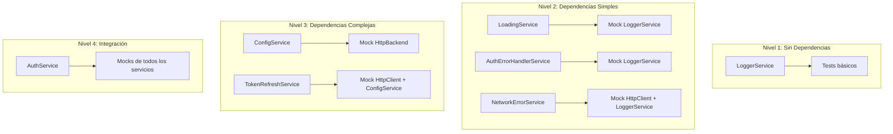

# Plan de Implementación: Tests Unitarios para Servicios Core

## Resumen Ejecutivo

Este documento detalla el plan para implementar tests unitarios en los servicios core del proyecto UyuniAdmin Frontend, siguiendo las mejores prácticas de testing en Angular 21 con Jest.

---

## Estado Actual

| Aspecto | Estado |
|---------|--------|
| **Framework de testing** | ✅ Jest 30.2.0 configurado |
| **Preset** | ✅ jest-preset-angular 16.0.0 |
| **Tests existentes** | ⚠️ Solo `app.component.spec.ts` |
| **Coverage threshold** | ❌ No configurado |
| **Tests de servicios** | ❌ No existen |

---

## Servicios a Testear

### Análisis de Complejidad

| Servicio | Líneas | Dependencias | Complejidad | Prioridad |
|----------|--------|--------------|-------------|-----------|
| [`LoggerService`](src/app/core/services/logger.service.ts) | 151 | Ninguna | Baja | 🔴 1 |
| [`LoadingService`](src/app/core/services/loading.service.ts) | 151 | Router, LoggerService | Media | 🟡 2 |
| [`NetworkErrorService`](src/app/core/services/network-error.service.ts) | 76 | NgZone, HttpClient, LoggerService | Media | 🟡 3 |
| [`AuthErrorHandlerService`](src/app/core/services/auth-error-handler.service.ts) | 206 | LoggerService | Media | 🟡 4 |
| [`TokenRefreshService`](src/app/core/services/token-refresh.service.ts) | 123 | HttpClient, ConfigService, LoggerService | Alta | 🟠 5 |
| [`ConfigService`](src/app/core/config/config.service.ts) | 84 | HttpBackend, LoggerService | Media | 🟠 6 |
| [`AuthService`](src/app/core/auth/auth.service.ts) | 269 | HttpClient, ConfigService, Router, LoadingService, LoggerService, TokenRefreshService | Alta | 🔴 7 |

---

## Arquitectura de Testing



---

## Configuración de Coverage Threshold

### Archivo: `jest.config.js`

```javascript
module.exports = {
  preset: 'jest-preset-angular',
  setupFilesAfterEnv: ['<rootDir>/src/setup-jest.ts'],
  
  // Coverage configuration
  collectCoverage: true,
  coverageReporters: ['text', 'lcov', 'html'],
  coverageDirectory: 'coverage',
  
  // Coverage thresholds (mínimo requerido)
  coverageThreshold: {
    global: {
      branches: 70,
      functions: 75,
      lines: 80,
      statements: 80
    }
  },
  
  // Files to collect coverage from
  collectCoverageFrom: [
    'src/app/**/*.ts',
    '!src/app/**/*.spec.ts',
    '!src/app/**/*.d.ts',
    '!src/app/**/index.ts',
    '!src/main.ts',
    '!src/setup-jest.ts'
  ],
  
  // Transform ignore patterns
  transformIgnorePatterns: [
    'node_modules/(?!(@angular|primeng|@primeuix))'
  ]
};
```

---

## Estructura de Archivos de Test

```
src/app/core/
├── auth/
│   ├── auth.service.ts
│   └── auth.service.spec.ts          # NUEVO
├── config/
│   ├── config.service.ts
│   └── config.service.spec.ts        # NUEVO
├── services/
│   ├── loading.service.ts
│   ├── loading.service.spec.ts       # NUEVO
│   ├── logger.service.ts
│   ├── logger.service.spec.ts        # NUEVO
│   ├── token-refresh.service.ts
│   ├── token-refresh.service.spec.ts # NUEVO
│   ├── auth-error-handler.service.ts
│   ├── auth-error-handler.service.spec.ts  # NUEVO
│   ├── network-error.service.ts
│   └── network-error.service.spec.ts # NUEVO
└── guards/
    └── auth.guard.spec.ts            # NUEVO (opcional)
```

---

## Detalle de Tests por Servicio

### 1. LoggerService (Prioridad 1 - Sin dependencias)

**Tests a implementar:**

| # | Test | Descripción |
|---|------|-------------|
| 1 | `should be created` | Verificar inyección |
| 2 | `should log debug messages when level is DEBUG` | Log level DEBUG |
| 3 | `should not log debug messages when level is INFO` | Filtrado por nivel |
| 4 | `should log info messages` | Log level INFO |
| 5 | `should log warn messages` | Log level WARN |
| 6 | `should log error messages` | Log level ERROR |
| 7 | `should set min level from string` | Configuración dinámica |
| 8 | `should group logs when level is DEBUG` | Console.group |
| 9 | `should time async operations` | Console.time |

**Ejemplo de implementación:**

```typescript
// logger.service.spec.ts
import { TestBed } from '@angular/core/testing';
import { LoggerService, LogLevel } from './logger.service';

describe('LoggerService', () => {
  let service: LoggerService;
  let consoleSpy: jest.SpyInstance;

  beforeEach(() => {
    TestBed.configureTestingModule({});
    service = TestBed.inject(LoggerService);
  });

  it('should be created', () => {
    expect(service).toBeTruthy();
  });

  it('should log debug messages when level is DEBUG', () => {
    consoleSpy = jest.spyOn(console, 'debug').mockImplementation();
    service.setMinLevel(LogLevel.DEBUG);
    service.debug('Test message', { key: 'value' }, 'TestContext');
    expect(consoleSpy).toHaveBeenCalledWith('[TestContext] Test message', { key: 'value' });
  });

  it('should not log debug messages when level is INFO', () => {
    consoleSpy = jest.spyOn(console, 'debug').mockImplementation();
    service.setMinLevel(LogLevel.INFO);
    service.debug('Test message');
    expect(consoleSpy).not.toHaveBeenCalled();
  });
});
```

---

### 2. LoadingService (Prioridad 2)

**Tests a implementar:**

| # | Test | Descripción |
|---|------|-------------|
| 1 | `should be created` | Verificar inyección |
| 2 | `should start with isLoading false` | Estado inicial |
| 3 | `should set isLoading true after showLoader` | Mostrar loader |
| 4 | `should set isLoading false after hideLoader` | Ocultar loader |
| 5 | `should handle multiple showLoader calls` | Contador de requests |
| 6 | `should not set isLoading false until all requests complete` | Contador funciona |
| 7 | `should force reset loading state` | Force reset |
| 8 | `should set isNavigating true on NavigationStart` | Router events |
| 9 | `should set isNavigating false on NavigationEnd` | Router events |
| 10 | `should trigger fail-safe after timeout` | Fail-safe timer |

**Mocks necesarios:**

```typescript
// loading.service.spec.ts
import { TestBed } from '@angular/core/testing';
import { Router, NavigationStart, NavigationEnd } from '@angular/router';
import { LoadingService } from './loading.service';
import { LoggerService } from './logger.service';

describe('LoadingService', () => {
  let service: LoadingService;
  let routerMock: jest.Mocked<Router>;
  let loggerMock: jest.Mocked<LoggerService>;

  beforeEach(() => {
    loggerMock = {
      debug: jest.fn(),
      warn: jest.fn()
    } as any;

    routerMock = {
      events: {
        subscribe: jest.fn()
      }
    } as any;

    TestBed.configureTestingModule({
      providers: [
        LoadingService,
        { provide: LoggerService, useValue: loggerMock },
        { provide: Router, useValue: routerMock }
      ]
    });

    service = TestBed.inject(LoadingService);
  });

  it('should be created', () => {
    expect(service).toBeTruthy();
  });
});
```

---

### 3. NetworkErrorService (Prioridad 3)

**Tests a implementar:**

| # | Test | Descripción |
|---|------|-------------|
| 1 | `should be created` | Verificar inyección |
| 2 | `should start with showConnectionError false` | Estado inicial |
| 3 | `should set showConnectionError true on trigger` | Trigger error |
| 4 | `should reset error state` | Reset error |
| 5 | `should return true on successful connection check` | Check connection OK |
| 6 | `should return false on failed connection check` | Check connection FAIL |

---

### 4. AuthErrorHandlerService (Prioridad 4)

**Tests a implementar:**

| # | Test | Descripción |
|---|------|-------------|
| 1 | `should be created` | Verificar inyección |
| 2 | `should handle 401 as INVALID_CREDENTIALS` | Error 401 |
| 3 | `should handle 403 with ACCOUNT_LOCKED code` | Error 403 locked |
| 4 | `should handle 403 without specific code` | Error 403 genérico |
| 5 | `should handle 0 status as NETWORK_ERROR` | Error de red |
| 6 | `should handle 5xx as SERVER_ERROR` | Error servidor |
| 7 | `should handle unknown errors` | Error desconocido |
| 8 | `should return correct message for error code` | getMessage() |

---

### 5. TokenRefreshService (Prioridad 5)

**Tests a implementar:**

| # | Test | Descripción |
|---|------|-------------|
| 1 | `should be created` | Verificar inyección |
| 2 | `should start with isRefreshing false` | Estado inicial |
| 3 | `should return error if no refresh token` | Sin refresh token |
| 4 | `should call API and store tokens on success` | Refresh exitoso |
| 5 | `should queue requests during refresh` | Queue requests |
| 6 | `should handle refresh failure` | Refresh fallido |
| 7 | `should reset state on logout` | Reset state |

---

### 6. ConfigService (Prioridad 6)

**Tests a implementar:**

| # | Test | Descripción |
|---|------|-------------|
| 1 | `should be created` | Verificar inyección |
| 2 | `should load config from assets` | Carga de config |
| 3 | `should return apiUrl` | Getter apiUrl |
| 4 | `should return authConfig` | Getter authConfig |
| 5 | `should return featureFlags` | Getter featureFlags |
| 6 | `should return default version if not set` | Getter appVersion |
| 7 | `should handle config load error` | Error handling |

---

### 7. AuthService (Prioridad 7 - Integración)

**Tests a implementar:**

| # | Test | Descripción |
|---|------|-------------|
| 1 | `should be created` | Verificar inyección |
| 2 | `should start with isAuthenticated false if no token` | Estado inicial |
| 3 | `should start with isAuthenticated true if token exists` | Estado con token |
| 4 | `should login successfully with mock auth` | Login mock |
| 5 | `should login successfully with real API` | Login real |
| 6 | `should handle login error 401` | Error 401 |
| 7 | `should handle login error 403` | Error 403 |
| 8 | `should logout and clear session` | Logout |
| 9 | `should refresh token successfully` | Token refresh |
| 10 | `should fetch roles on login` | Fetch roles |
| 11 | `should set active role` | setActiveRole |
| 12 | `should fetch menu for role` | fetchMenu |

---

## Comandos de Ejecución

```bash
# Ejecutar todos los tests
npm test

# Ejecutar tests con coverage
npm test -- --coverage

# Ejecutar tests en watch mode
npm test -- --watch

# Ejecutar tests de un archivo específico
npm test -- logger.service.spec.ts

# Ejecutar tests con filtro por nombre
npm test -- --testNamePattern="LoggerService"
```

---

## Checklist de Implementación

### Fase 1: Configuración Base
- [ ] Actualizar `jest.config.js` con coverage threshold
- [ ] Verificar que `npm test` funciona correctamente
- [ ] Configurar script de CI para tests

### Fase 2: Tests de Servicios Sin Dependencias
- [ ] Implementar `logger.service.spec.ts`
- [ ] Verificar coverage > 80% en LoggerService

### Fase 3: Tests de Servicios con Dependencias Simples
- [ ] Implementar `loading.service.spec.ts`
- [ ] Implementar `auth-error-handler.service.spec.ts`
- [ ] Implementar `network-error.service.spec.ts`

### Fase 4: Tests de Servicios Complejos
- [ ] Implementar `config.service.spec.ts`
- [ ] Implementar `token-refresh.service.spec.ts`

### Fase 5: Tests de Integración
- [ ] Implementar `auth.service.spec.ts`

### Fase 6: Verificación Final
- [ ] Ejecutar todos los tests
- [ ] Verificar coverage global > 80%
- [ ] Actualizar documentación

---

## Documentación a Generar

Al finalizar, se creará/actualizará:

1. **`docs/UNIT_TESTING_GUIDE.md`** - Guía completa de testing
   - Configuración de Jest
   - Patrones de test para servicios
   - Mocks y spies
   - Coverage y thresholds
   - Ejemplos prácticos

2. **Actualizar `docs/ARCHITECTURE.md`** - Sección de testing

3. **Actualizar `README.md`** - Comandos de testing

---

## Tiempos Estimados

| Fase | Duración |
|------|----------|
| Fase 1: Configuración | 30 min |
| Fase 2: LoggerService | 1 hora |
| Fase 3: Servicios simples | 2-3 horas |
| Fase 4: Servicios complejos | 2-3 horas |
| Fase 5: AuthService | 2-3 horas |
| Fase 6: Documentación | 1-2 horas |
| **Total** | **8-12 horas** |

---

## Notas Importantes

1. **Orden de implementación**: Seguir el orden de dependencias (Nivel 1 → Nivel 4)
2. **Mocks**: Usar `jest.fn()` para mocks y `jest.SpyInstance` para spies
3. **Signals**: Para tests de signals, usar `signal()` directamente en los tests
4. **Async**: Usar `fakeAsync` y `tick()` para tests con timers
5. **HTTP**: Usar `HttpTestingController` para tests de HttpClient

---

*Documento creado: Marzo 2026*
*Última actualización: Marzo 2026*
